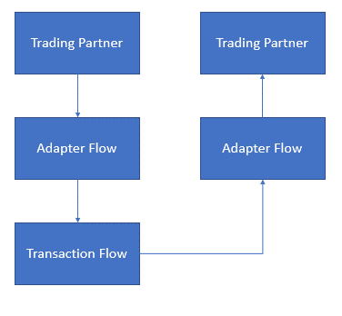

Overview
========

In this hands-on lab, we will be demonstrating a typical EAI message endpoint
pattern implementation with Azure Logic App and APIM.

In real world, each trading partner can use different protocols such as FTP,
HTTP and Queue…etc; Message pattern in EAI is to separate message sending and
receiving process with message channel, so that each part knows only small
pieces of the message processing process.

A high-level overview of the architecture illustrated below.

-   Trading Partner represents the organization that will be sending or
    receiving documents (sales orders for example).

-   Adapter Flow represents a sub-flow that handles incoming and outgoing
    messages, including transform and validation.

-   Transaction Flow is the flow to process this message, including enrich
    messages.

We will use this hands-on lab to create above flow. Below function and services
will be covered in this document.

-   Logic App

-   API Management

-   Azure AD

-   Azure Functions

-   Monitoring your flow

Prerequisites
=============

-   Azure Subscription

-   Visual Studio Code

-   Visual Studio Community + (For creating frontend and backend API)

Table of Content
================

-   Preparation

    -   [Create a Backend API App](backendapi-setup-azuread.md#create-a-backend-api-app)

    -   [Set up Azure AD Authentication for Backend API](backendapi-setup-azuread.md#configure-azure-ad-authentication-for-your-backend-api)

    -   [Verify Azure AD with Frontend App](backendapi-setup-azuread.md#register-frontend-application)

-   Create business flow

    -   [Integration
        Account](create-receiver-adapter.md#create-an-integration-account)

    -   [Service Bus Queue](create-receiver-adapter.md#create-service-bus-queue)

    -   [Receiver Adapter](create-receiver-adapter.md)

    -   [Send Adapter](create-send-adapter.md)

    -   [Business Flow](create-business-flow.md)
    
    -   [Invoke API with Azure AD Authentication](create-business-flow.md#invoke-azure-ad-protected-api-in-logic-app)

    -   [Batch Processing](logicapp-batch-processing)

    -   (Optional) [Invoke on-prem Web Service](logicapp-hybrid-connection.md)

-   Secure and Manage your Logic App API

    -   [APIM integration with Logic App](apim-configure-apim-with-logicapp.md#create-an-apim-managed-logic-app-api)

    -   [Secure APIM API with Azure AD OAuth 2.0](apim-configure-oauth20.md)

-   Monitor yout business flow

    -   [Tracked Properties and Log Analysis](logicapp-loganalysis.md)

