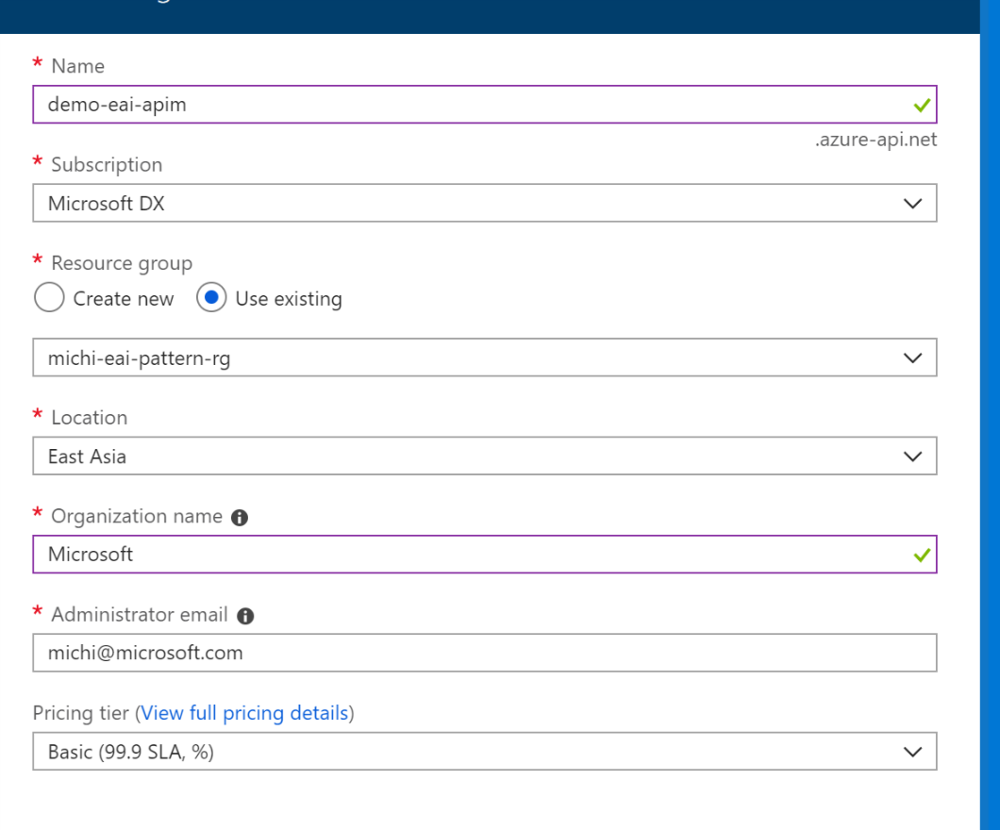

Overview
========

An API Management instance is an API gateway that provides throttling control,
access restriction control and management to your APIs. In this lab we will be
managing our APIs with APIM and configure access restriction policy to restrict
access to our APIs.

In this document we will be demonstrating how APIM protects and manages your
backend API. We will configure APIM to allow and check Oauth 2.0 based
authentication token. We will also configure Logic App to allow traffic from
APIM only so that your Logic App is protected by APIM with Oauth 2.0.

Prerequirests
=============

-   Azure Subscription

-   Complete [Backend API Azure AD setup](backendapi-setup-azuread.md) and
    [business flow Logic Apps](create-business-flow.md)

Create an APIM managed Logic App API
====================================

-   Goto Azure Portal, create an empty APIM instance, here I choose Basic tier,
    for development and testing purpose, Developer tier is sufficient.

