Overview
========

In this section we will be configuring OAuth 2.0 authentication with APIM and
setup Access Restriction Policy in APIM to verify particular JWT claim
existence.

>   Note: - APIM is NOT validating OAuth 2.0 token but just check if incoming
>   request fulfill Restriction Policy configured. If valid, APIM pass all Http
>   Header to following APIs. - Logic App is not accepting Authorization Http
>   Header, so we need to deal with Authorization before forwarding request to
>   Logic App in APIM policy.

Configure APIM with OAuth 2.0

-   To configure OAuth 2.0, Go to APIM console, OAuth 2.0

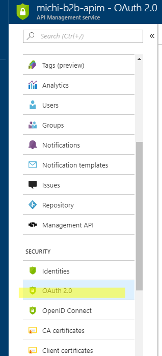

-   Now we are to create a new OAuth 2.0 authentication service for APIM.

    -   Display name is a friendly name to describe this OAuth 2.0 instance

    -   Id will be automatically generated, you can modify it later

    -   Client Registration page URL is the URL of your client application
        registration page. Give it a placeholder here.

    -   Authorization grant types decides how your client application
        permissions are granted. Details of each grant type can be found
        [here](https://oauth.net/2/grant-types/). In this lab we check
        Authorization code and Client credentials to support user login and API
        direct calls.

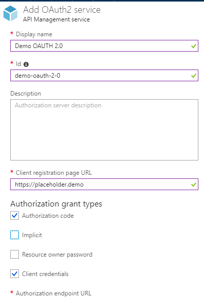

-   Authorization URL is where authorization happened when user logs in or when
    client application request access to our API. It can be retrieved from Azure
    AD console, App registrations, Endpoints

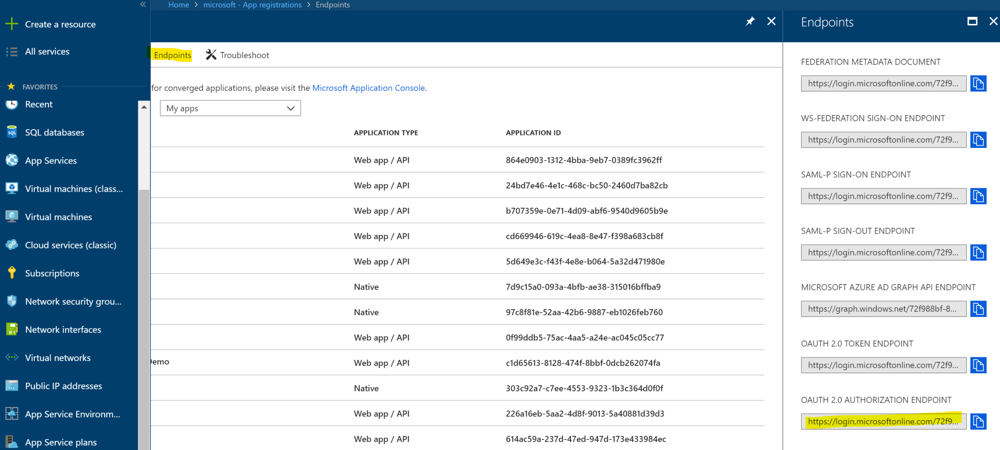

-   Token URL is where the Authorization tokens were generated, this can also be
    retrieved from Azure Ad Endpoints page shown above.

-   For Http request methods, we will be supporting both GET and POST.

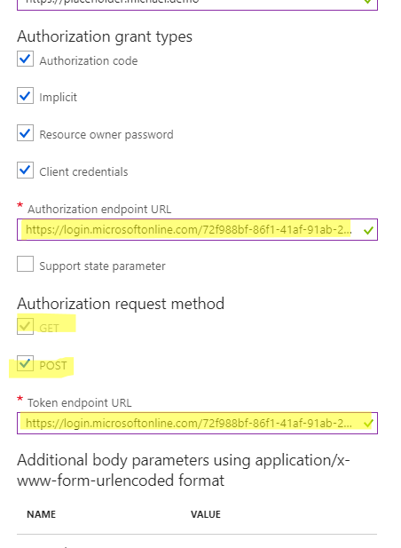

-   Next, we want to let this Authorization instance knows which Azure AD
    resources client is requesting. Here we need to supply Backend API’s
    application Id in Azure AD.

>   Note

>   When a user or an API is requesting AD resources, AD generates a token that
>   contains the audience Id. While accessing the Azure AD secured resource, it
>   should check if the request has sufficient permission to access it. In Azure
>   we do this by configuring Azure AD authorization/authentication in App
>   Service configuration blade.

>   In this lab, we want to verify if frontend does has permission to invoke our
>   Backend API from Logic App, so here we use the Backend API’s resource Id
>   (Application Id).

>   To get that, go to Azure AD and search our registered Backend application
>   and copy its Application ID.

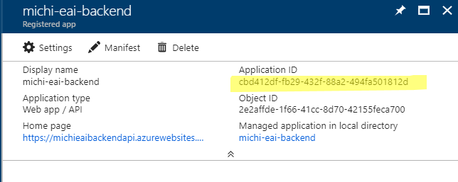

-   Add a resource in APIM’s OAuth 2.0 config blade.

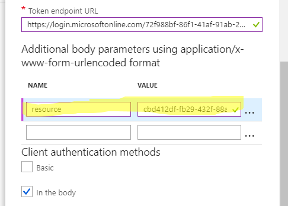

-   Then we specify the client credential that represents our client application
    from Azure AD.

>   Go to Azure AD, find your Frontend application, Go to Keys and generate a
>   new key. Copy its application Id and new Key.

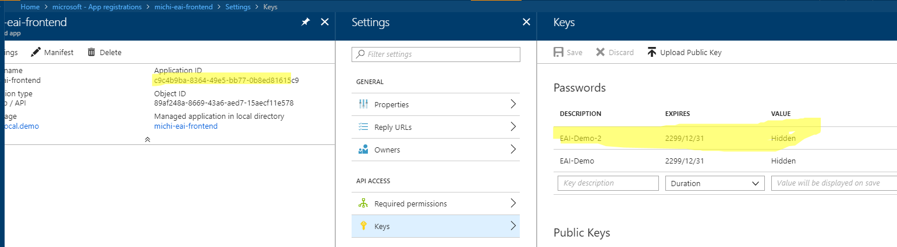

-   Paste it.

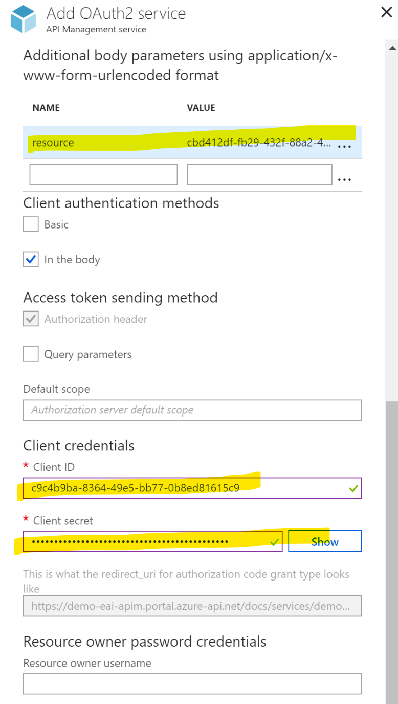

-   Copy the Reply URL generated by APIM OAuth 2.0, we need to update our
    frontend Azure AD application’s Reply URL with this one.

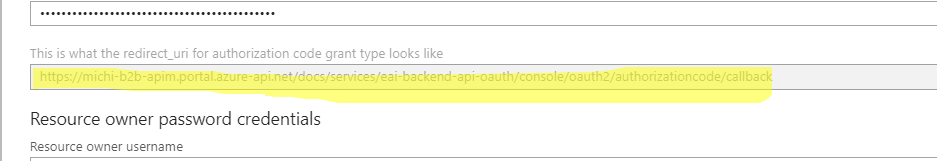

-   Click Create to complete creation

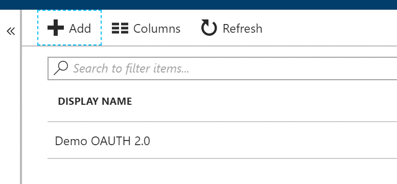

-   Now we have successfully created OAuth 2.0 authorization for APIM, now go
    back to APIM, APIs, Your Logic API, Settings

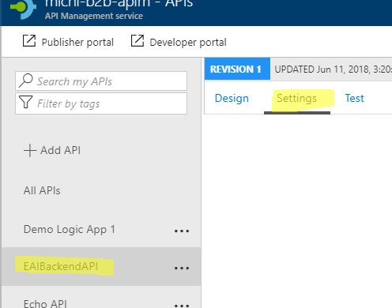

-   Choose OAuth Authentication we just created

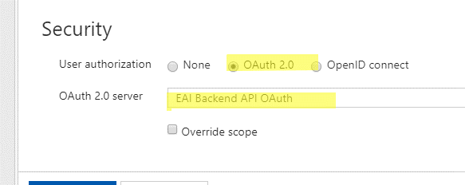

-   Go to Azure AD, we need to update Frontend App’s Reply URL

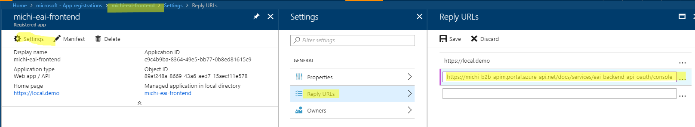

-   Now we have completed OAuth 2.0 setup. If you go to Developer portal and do
    a HTTP POST there with OAuth 2.0 option we will get an error.

>   This error message is not returned from APIM but from Logic App. APIM pass
>   whatever is in HTTP Header to following APIs, including Authorization
>   header. However, Logic App does not allow Authorization header hence returns
>   this error message.

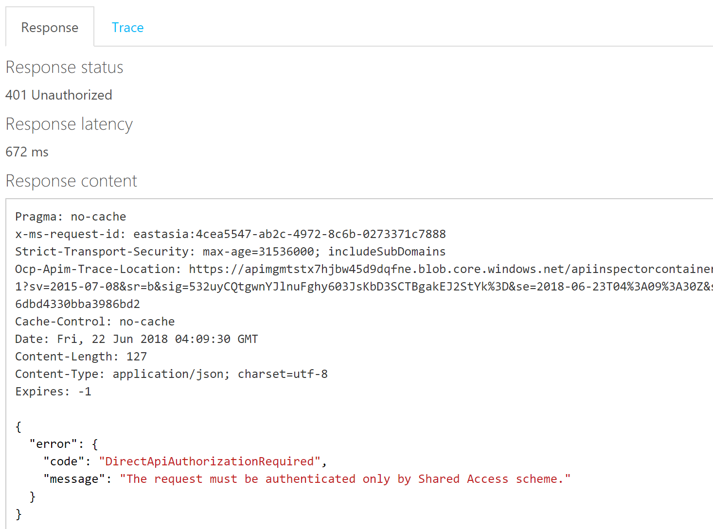

-   To fix this, we need to remove Authorization header in APIM. We do this by
    creating a new Access Restriction Policy in APIM.

-   Go to APIM console, click on our Logic API. In Design tab, we can add an
    Access Restriction Policy to all operations provided by this API, or we add
    to a particular operation of our choice. In this lab, we will add JWT
    validation policy and header policy to “manual-invoke” operation.

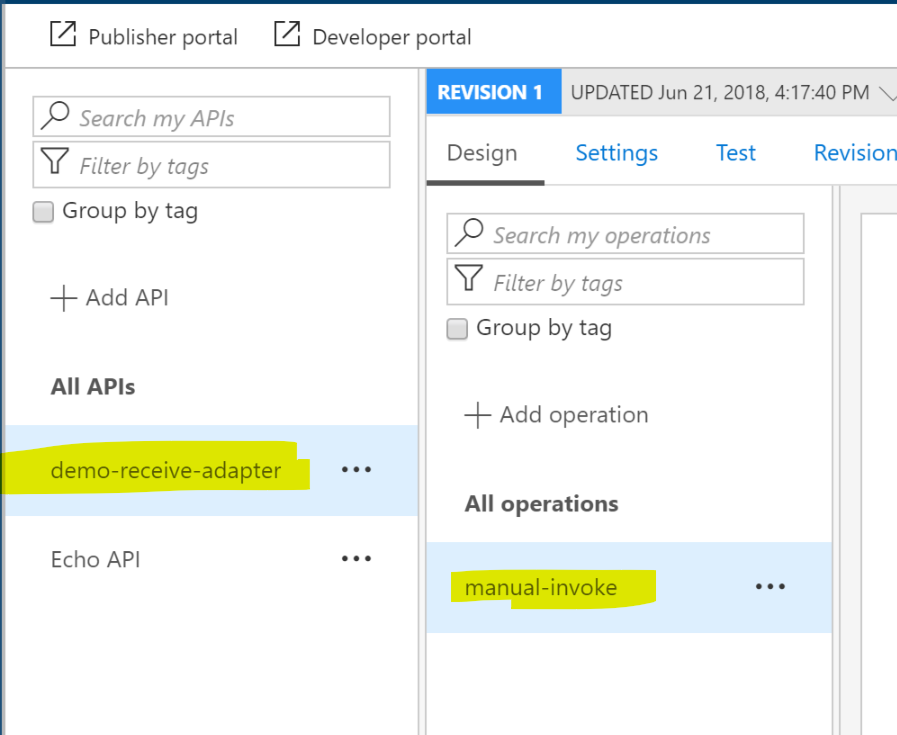

-   Click the operation, you’ll see 4 blocks appear in the right panel, each
    represents a step in APIM which are: Inbound, Backend and outbound.

    -   Anything applied to incoming request will goes to Inbound section

    -   Anything applied before the request is forwarding to backend goes to
        Backend

    -   Anything applied to the response sent to frontend goes to Outbound
        section

    -   If any error occurs, goes to On-Error section

Detail of APIM policy is described here:
<https://docs.microsoft.com/zh-tw/azure/api-management/api-management-policies>

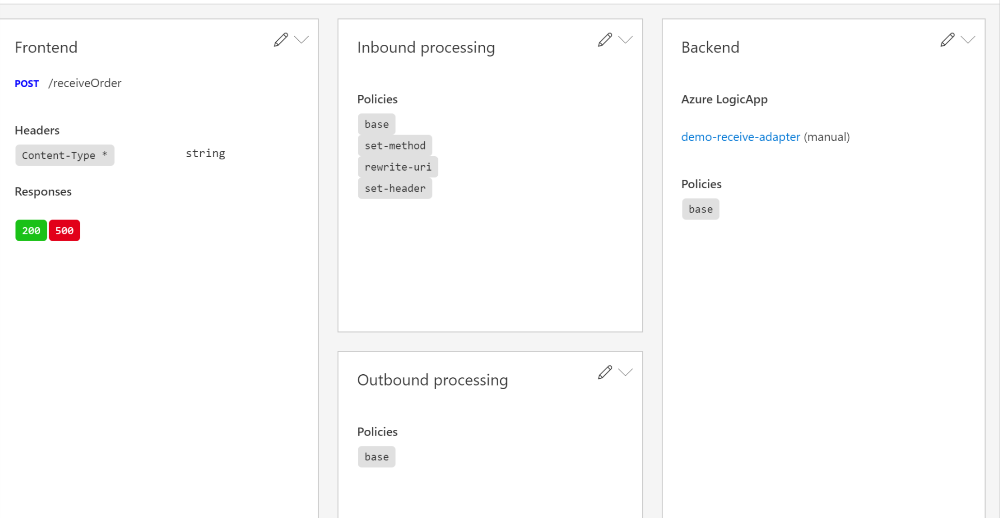

-   As this API is a wrapper APIM generated from Logic App, there’re already
    some policies been added.

>   We want to do three things here:

-   Remove “Authorization” HTTP header

-   Copy Authorization token to a new Header called APIM-Authorization

-   Verify if JWT token exists and its Audience set to our backend API.

-   Click Inbound Processing then Code editor to bring up editor

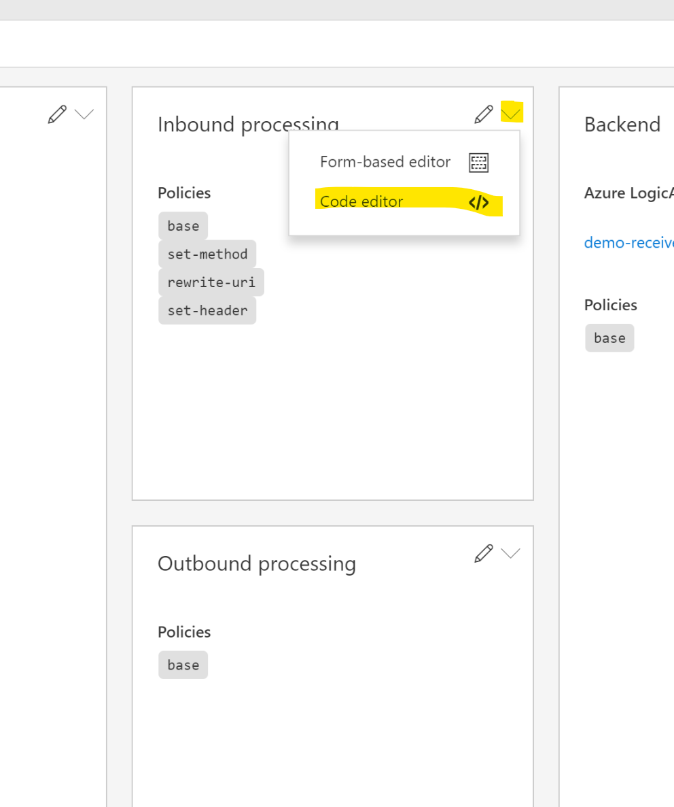

-   Append below codes to the last line of Inbound section.

    -   First “set-header” element override or create a new Header called APIM
        with value of Authorization Http Header, the OAuth authorization token

    -   Second “set-header” element delete existing Authorization header

\<set-header name="APIM" exists-action="override"\>

>   \<value\>\@(context.Request.Headers.GetValueOrDefault("Authorization","").Split('
>   ').Last())

>   \</value\>

\</set-header\>

\<set-header name="Authorization" exists-action="delete" /\>

-   Append below codes to the end of Inbound section to validate JWT token and
    claim existence

    -   Azure AD Tenant ID is the tenant Id of your Azure AD, can be found in
        Azure AD console, Endpoints

    -   Backend App Application Id is the Application Id of your Azure AD
        Backend Application

    -   Issuer is in the format of
        [https://sts.windows.net/\<Azure](https://sts.windows.net/%3cAzure) AD
        Tenant Id\>/

\<validate-jwt header-name="Authorization" failed-validation-httpcode="401"
failed-validation-error-message="Unauthorized"\>

\<openid-config url="https://login.microsoftonline.com/\<AZURE AD TENANT
ID\>/.well-known/openid-configuration" /\>

\<required-claims\>

\<claim name="aud" match="all"\>

\<value\>\<BACKEND APP APPLICATION ID\>\</value\>

\</claim\>

\<claim name="iss" match="all"\>

\<value\>\<ISSUER\>\</value\>

\</claim\>

\</required-claims\>

\</validate-jwt\>

-   Your code should look like below

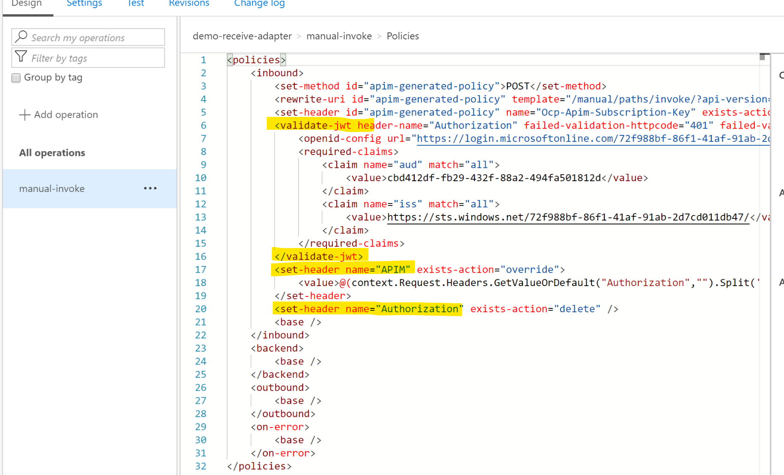

-   Save it, and go to Developer Portal. You should see OAuth 2.0 option here,
    choose Client Credentials to let portal automatically generate a token, the
    click Send to verify result

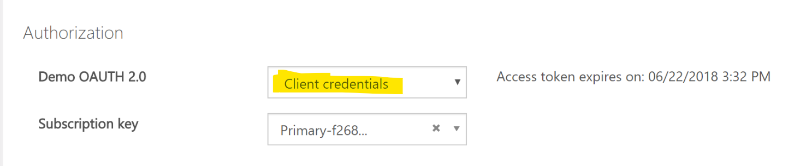

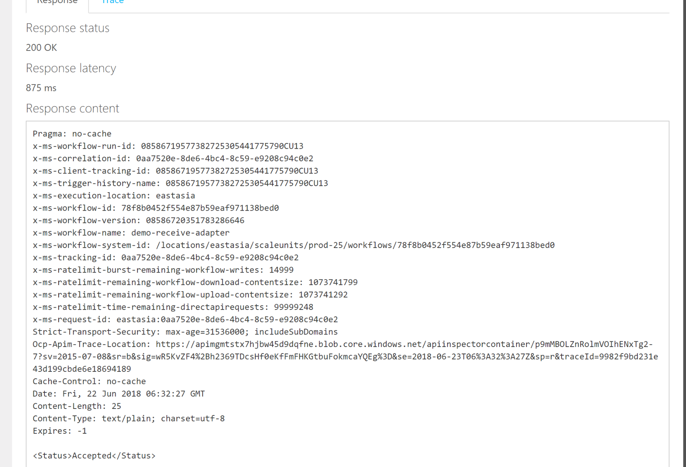
