Overview
========

In this lab we will be creating a Logic App that simulates Order business flow.
We will be addressing how a Logic App flow integrates with backend APIs with
Azure AD authentication and returns result to frontend. In a message pattern,
this usually refer to a Channel, which take messages from incoming adapter,
process and then send to next flow for further processing.

A high-level design looks like this

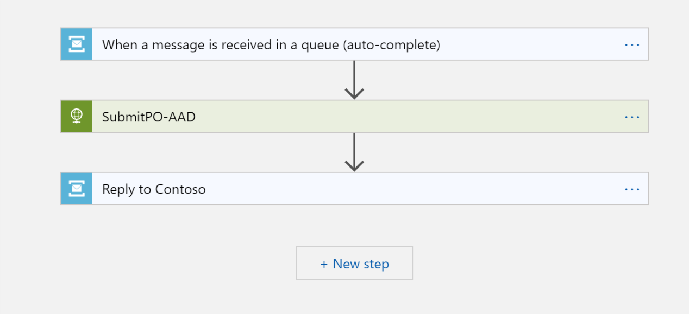

Create business flow
====================

-   This flow takes messages in the internal Service Bus Queue we created in
    previous lab, so here we will be using Service Bus connector to get those
    messages which we have been through it several times.

    -   Here we use a “auto-complete” trigger, which a message was found in the
        Service Bus Queue, it take that message from the queue and automatically
        complete that message. In this case, if the flow failed for some reason,
        we would have to handle that error and message in an error handler
        process, otherwise that message will be “lost”.

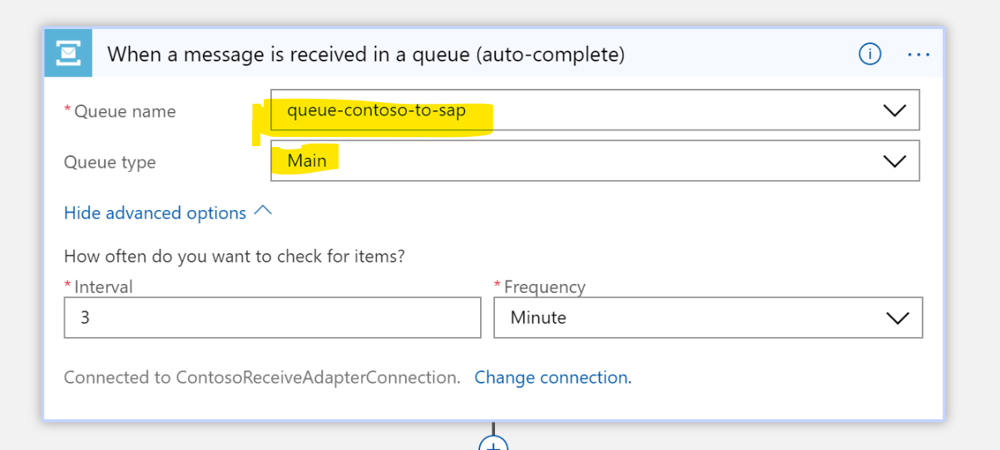

-   Next we want to invoke our backend API to process this message, in this lab
    we have already have our simulation backend REST API deployed to Azure. So
    here we will be creating a HTTP action to communicate with it.

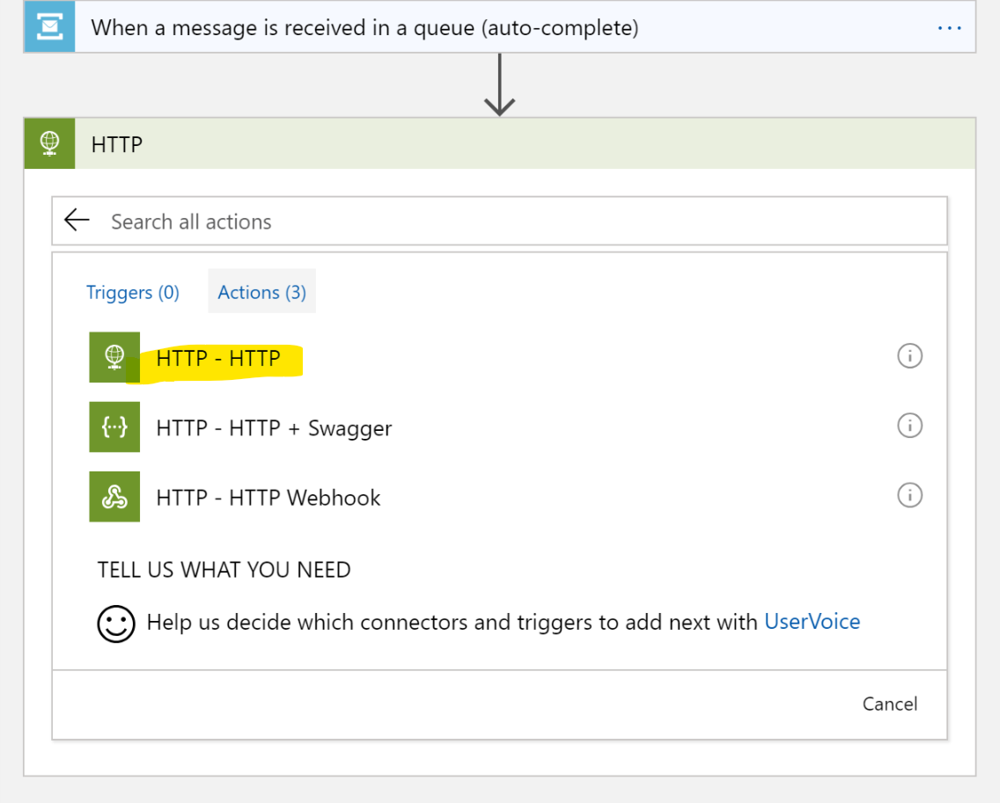

-   The API allows HTTP POST only, so we choose POST here and specify its URL

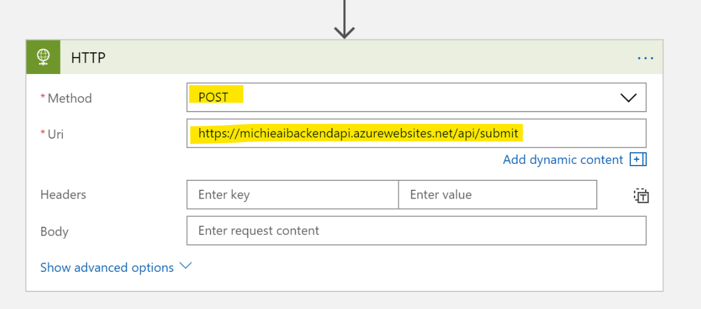

-   We want to modify our Posting body as a (custom-defined) JSON document with
    below format. In Logic App you do this by specifying your own content in
    text with “expressions” when needed.

-   In this case, the message content that will be sending to the backend API is
    the XML message content we retrieved from Service Bus Queue, we just need to
    decorate it with surrounding JSON tags.

{

“content”:”\<MESSAGE CONTENT\>”

}

-   Modify “Body” column as below

-   Move your cursor to the middle of “double quote”

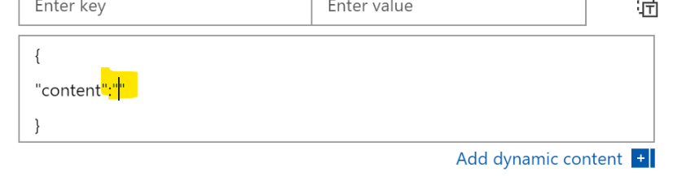

-   From right panel, click “Content” from Service Bus Action

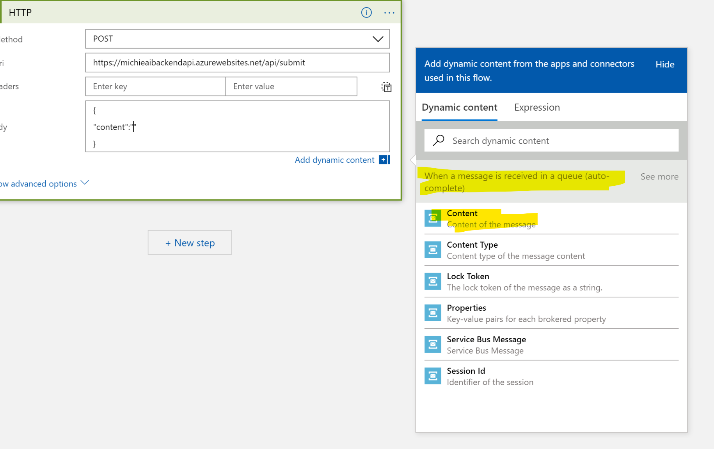

-   Your action should look similar to this

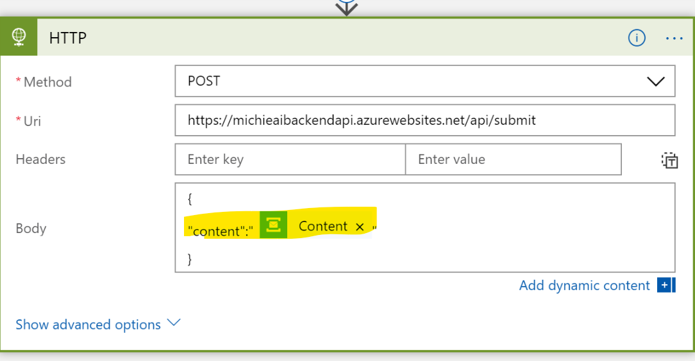

-   Now we want to send the message back to Contoso. Our protocol is to put
    messages to a particular queue so that Sender adapter flow will pick them up
    and send back to Contoso. So here we create a Service Bus – Send Message
    Action

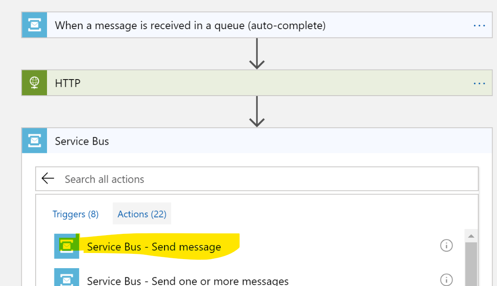

-   Message Body should be the output of previous HTTP action

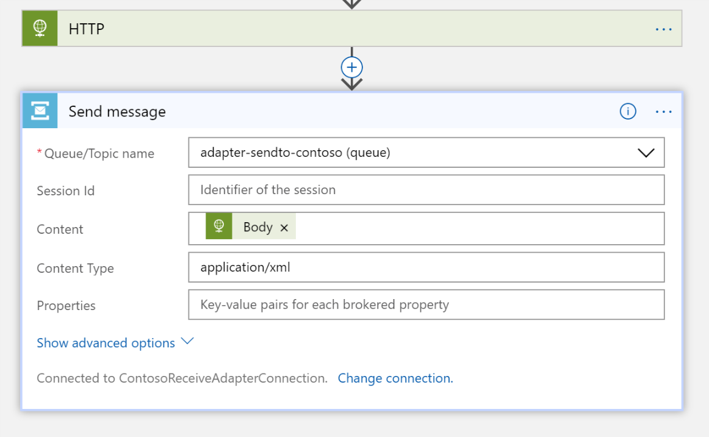

-   Now, let’s add an Action to handle errors. Click the “+” icon following HTTP
    action, and add an parallel branch.

-   When an error occurs, in this case, POST to internal API failed, depends on
    your business flow you may want to resubmit it again, or you may want to
    trigger other error handler flow to take care of that message. Here we want
    to send an email to administrators to take care of that particular order

-   You will need to sign-in to your Office 365 account in order to send emails
    on your behalf

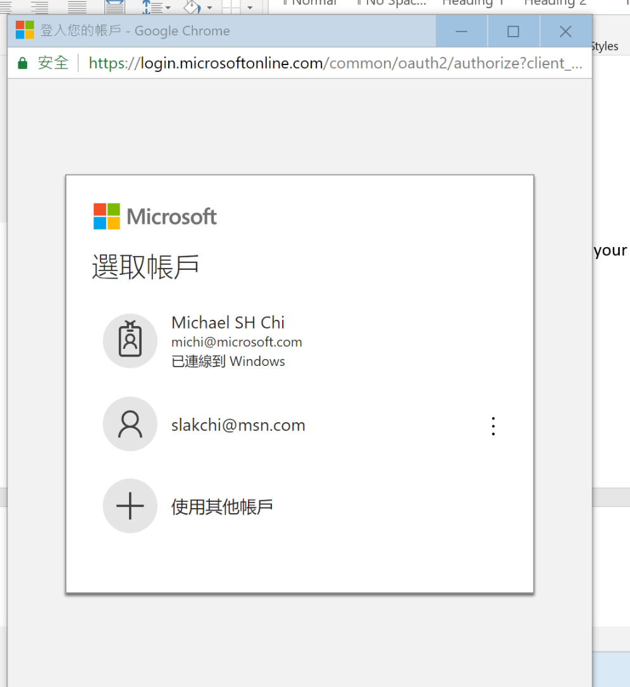

-   Email Body should be the message content from Service Bus Queue, you can
    modify properties of this email when needed.

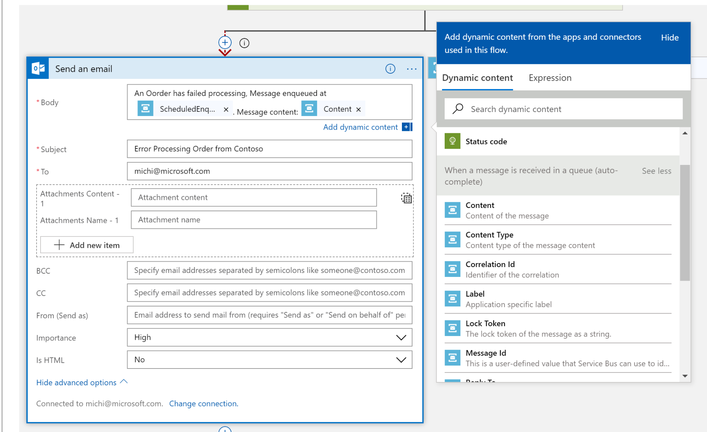

-   This Action should only be triggered when Invocation has failed

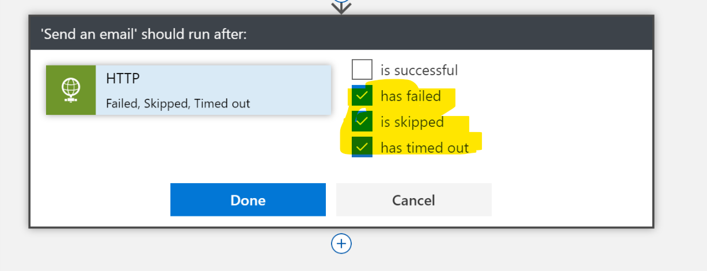

-   This is how your flow should look like

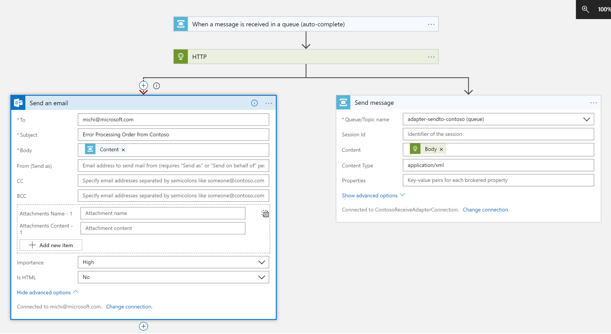

-   Save your Logic App

Invoke Azure AD Protected API in Logic App

In this section we will be discussing how a Logic App action invokes backend API
protected by Azure AD with Logic App’s built-in support.

-   Go to HTTP action

-   Click “Show Advanced Options”

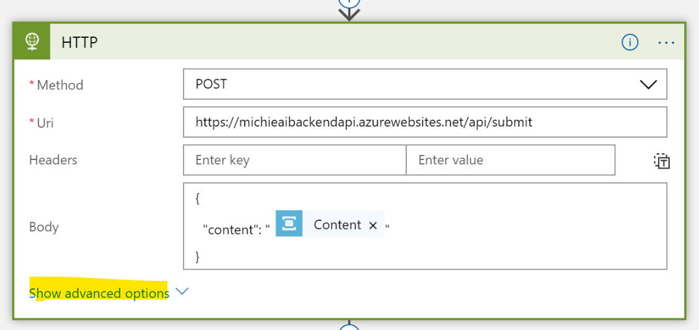

-   Choose Auzre AD Oauth

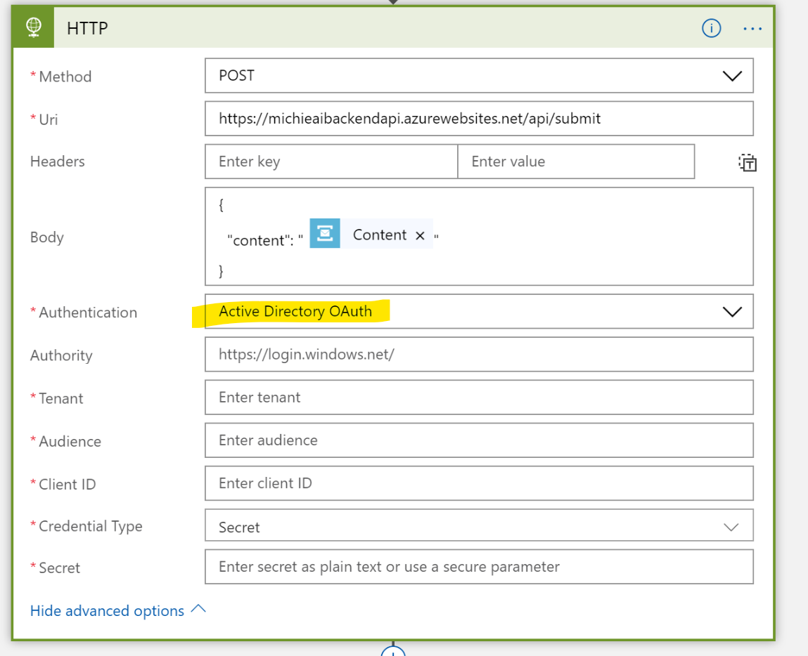

-   Fill in required information

    -   Tenant is the tenant ID of your Azure AD tenant, it can be found in
        Azure Active Directory, Properties, Directory ID

    -   Audience is the application Id of your backend application since after
        authentication succeed, the token audience is our backend application

    -   Client ID is your frontend application’s Azure AD application ID

    -   Credential Type should be Secret

    -   Secret is the Key we generated for your frontend application

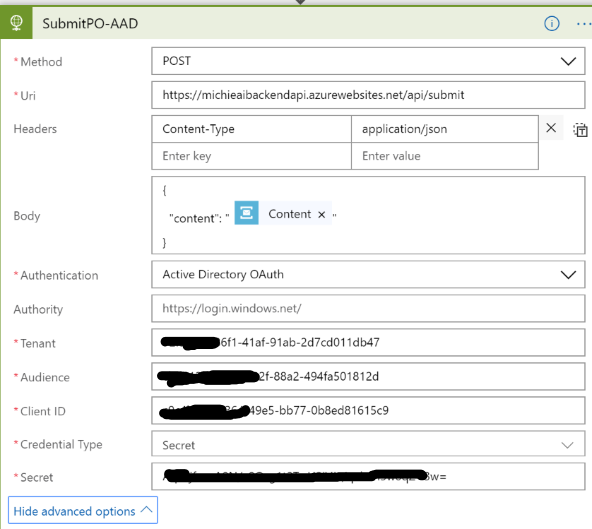

-   Click Save to save your changes.
