Overview
========

In this document, we will be creating a receiver adapter logic app to receive
messages sending to our organization from an external trading partner, in this
case, Contoso.

We will be using a pre-defined Xml schema as incoming message format, validate
incoming message with this schema and transform it to internal message format
and send transformed message to a Service Bus queue for further processing.
Incoming message will be coming through a HTTP REST endpoint provided by this
flow.

A high-level overview of the architecture illustrated below.

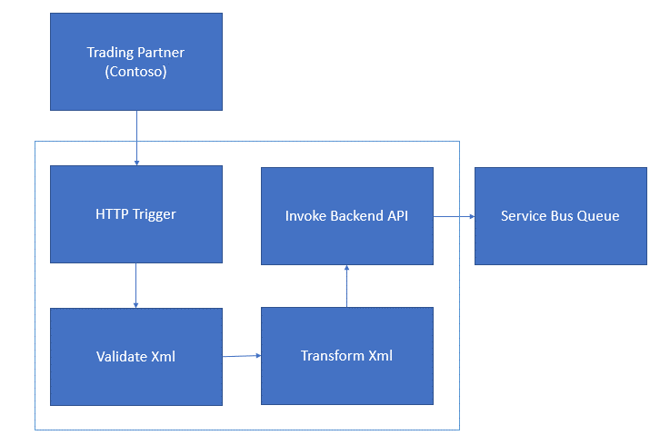

Prerequisites
=============

-   Azure Subscription

# Create an Integration Account
=============================

An Integration Account is a container that manages B2B artifacts used in your
flow.

-   Goto Azure Portal, create new Integration Account

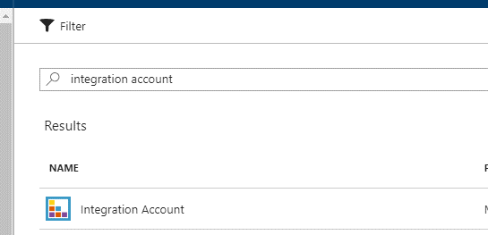

-   Give this account a name, which better matches to the trading partner’s
    name. In our case we can use
    [Basic](https://azure.microsoft.com/en-us/pricing/details/logic-apps/)
    pricing tier.

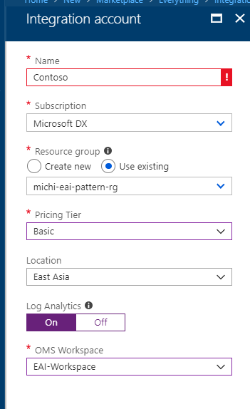

-   Once created, you should see console like below

-   Now we will be creating Schemas and Maps and add to this Integration Account
    so that our Logic App can access these artifacts in logic app flow.

-   For simplicity, we’ve provided pre-defined schema and maps
    [here](../source/LogicApps/Artifacts), you can create your own when needed.

-   Click the “Schemas” block, then Add a new Schema

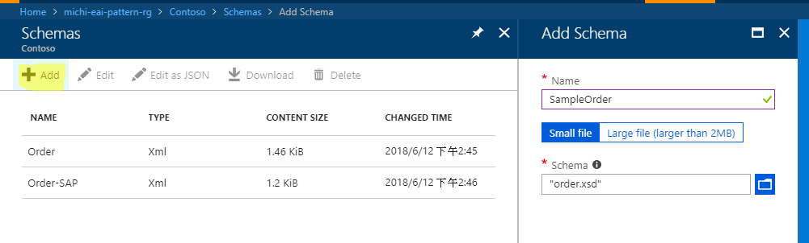

-   Repeat above steps to add Order.xsd and Order-Sap.xsd.

    -   Order.xsd is the schema of incoming messages from Contoso

    -   Order-Sap.xsd represents the schema of internal SAP message format

-   Click Maps block and add a new Map

    -   Order-Map-To-SAP map is the mapping between Order and internal SAP
        message format.

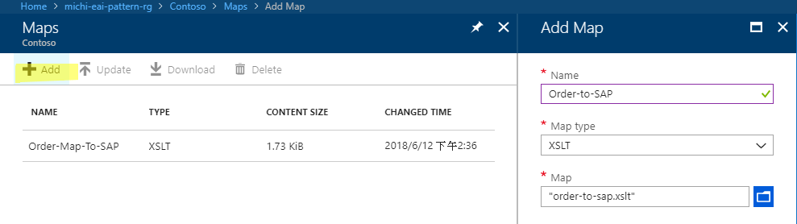

# Create Service Bus Queue
========================

In our lab we are using a Service Bus queue as an integration point between our
backend and logic app flow. In real case you can use other technology as it
provide reliability delivery.

-   Go to Azure Portal, create a new Service Bus namespace.

In our case a Basic tier service bus is sufficient.

-   Once created, add a queue

    -   Name of the queue should be easy to identify its purpose, for example,
        Contoso-To-SAP, so that administrators or developers can easily
        understand what the purpose of this queue is.

>   Your company may also have naming convention policy you want to follow.

-   In real life case, you may want to enable dead lettering so that your
    application has opportunities to handle expired messages.

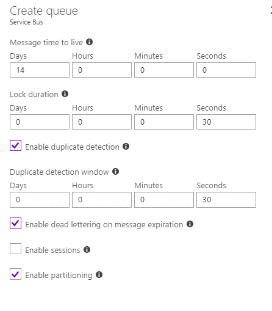

-   We need below three queues in this lab

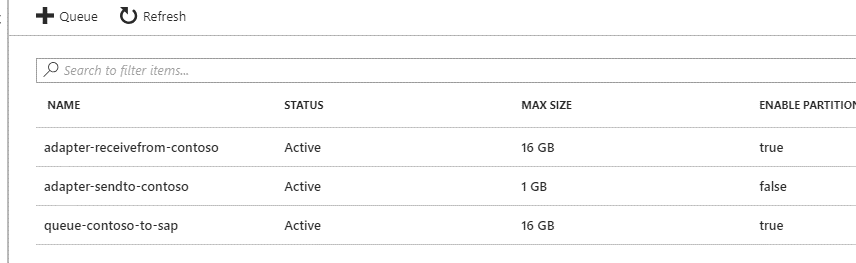

-   Adapter-receivefrom-contoso

>   As name suggested, this queue receives message from Contoso sending to our
>   organization

-   Adapter-sendto-contoso

>   Our organization will be sending messages to Contoso through this queue

-   Queue-contoso-to-sap

>   This is an internal queue for Contoso orders to be sent to SAP

# Create Receiver Adapter
=======================

In this section, we will be creating a receiver adapter flow to allow Contoso
submit their PO to our system.

-   Create an empty Logic App

    -   The name of the logic app should be human readable and understandable.
        For example in this case you can name your flow as
        “adapter-receiveFrom-Contoso” which as the name suggested, are to
        receive messages coming from Contoso

-   Once created, go to Logic App console, we need to associate this logic app
    with the Contoso Integration Account we created above

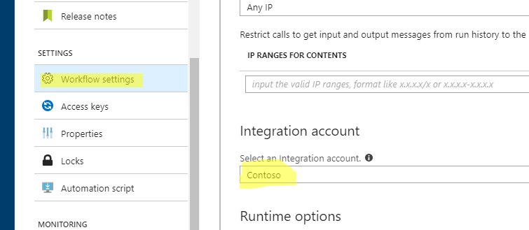

-   You should see below screen once created your Logic app. Click big cross to
    create a new blank Logic App

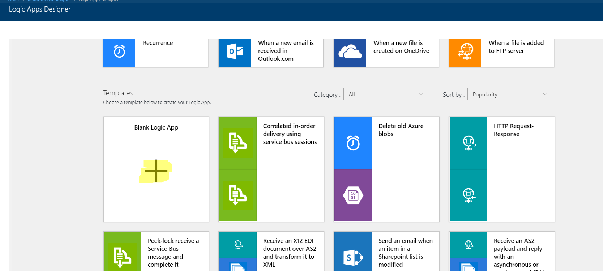

-   Since in this flow we are to receive messages coming from Contoso through
    HTTP REST endpoint, here we choose Request as our Logic App trigger.

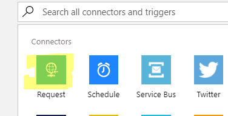

-   When a HTTP Request is received, we will trigger this process.

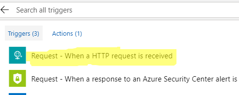

-   By default, Logic App Http trigger accepts Json format request body. If you
    do accept JSON document, here you can specify a sample JSON document so the
    Logic App generates schema for you to easily access its elements.

>   Here we are to accept XML body.

>   Click “Show advanced options”

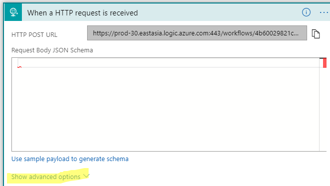

-   We want to accept HTTP POST only

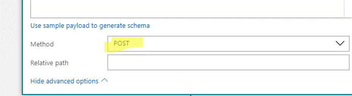

-   You can find our HTTP Endpoint here.

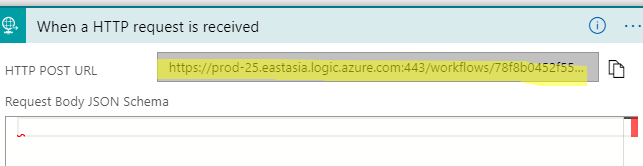

-   Click “New Step” to add a new step then add an Action

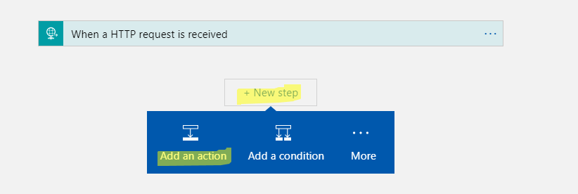

-   We want to validate incoming message is a valid XML

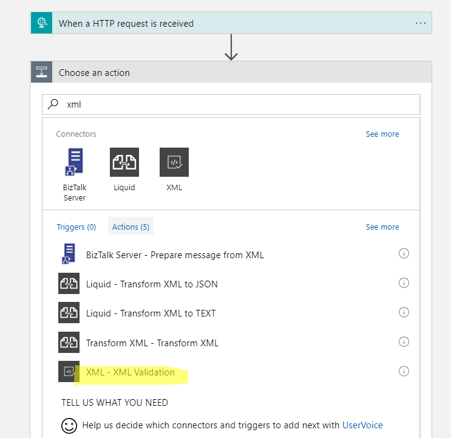

-   Here we define from which part of the request this action will be retrieve
    incoming Xml document from Http Trigger, and what is the schema name to
    valid the incoming message.

>   We assume the Xml is coming from HTTP POST body and we use pre-created Order
>   schema to validate incoming message

-   Once finished, create next action reply error message back to Contoso when
    Xml validation failed

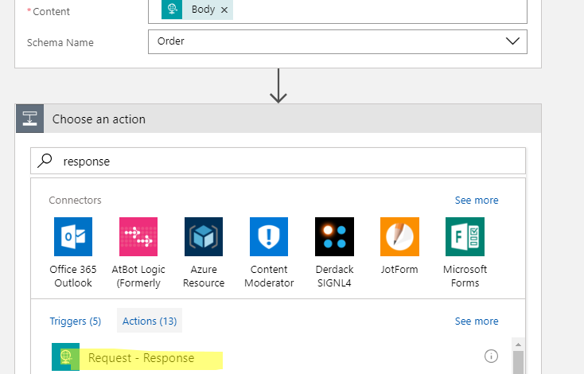

-   In this lab, we just return a Xml message that state the incoming message
    failed processing. In real case you may want to contain more detailed
    information to Contoso so they can handle it properly.

-   Fill in an error xml message in “Body” section then Click the “…” menu in
    the upper right corner then “Configure run after”

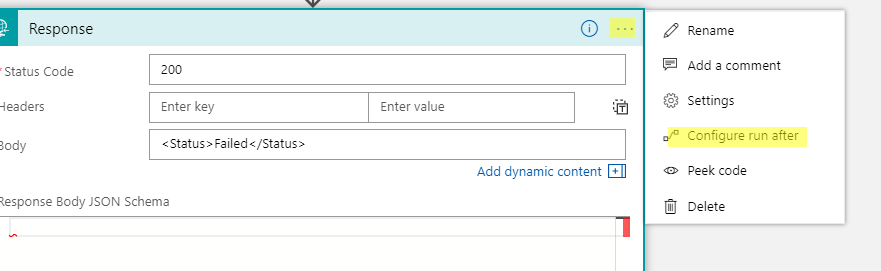

-   This action is to send error message back to trading partner (Contoso) so we
    only need to run this action when Xml validation failed

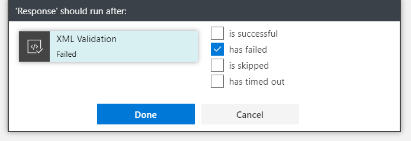

-   Your Logic App should look like below

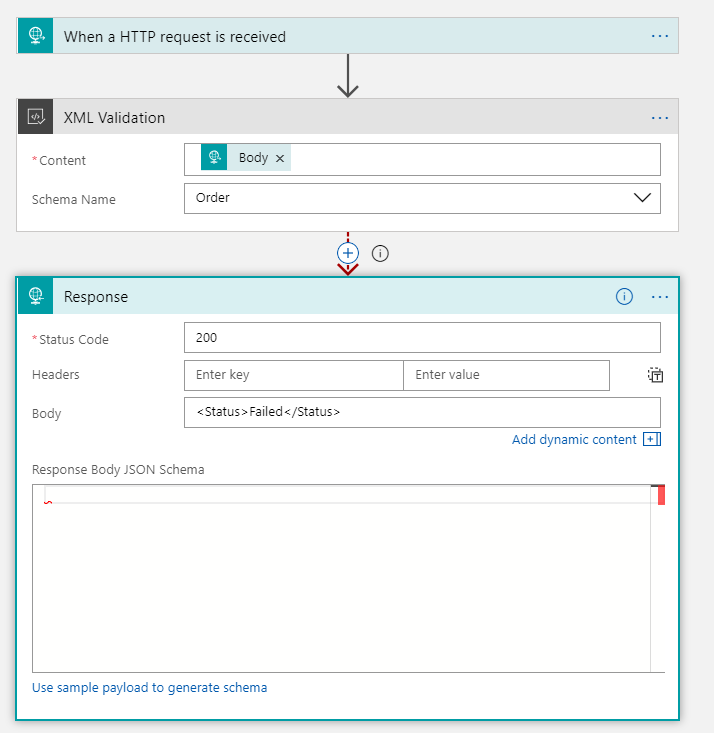

-   Next, we want to add an Action to transform incoming message to internal SAP
    acceptable message. This will be a parallel action that kicks-off only when
    Xml validation succeed.

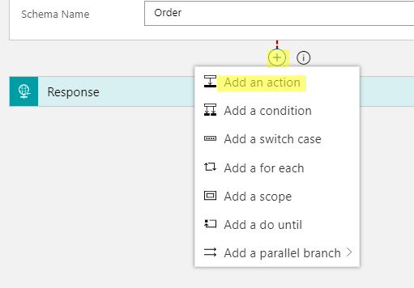

-   Add a xml transform action

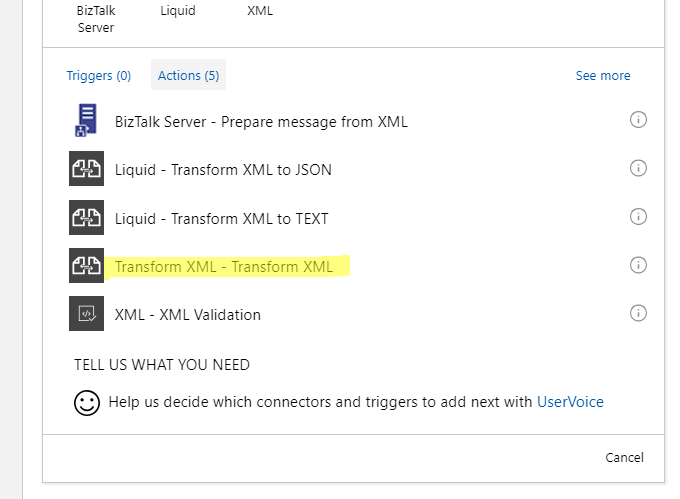

-   Specify Request body as Xml content and choose the map we created
    (Order-To-SAP) above as Map.

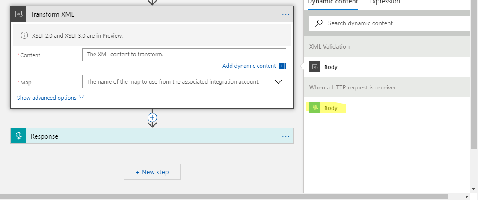

-   Your Action should look like below

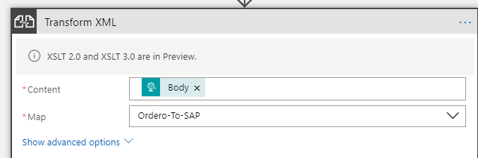

-   Also, we want this Action to be triggered when Xml validation succeed

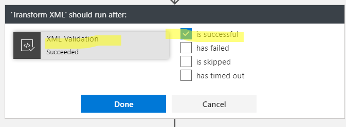

-   At this point, your Logic App should looks like below

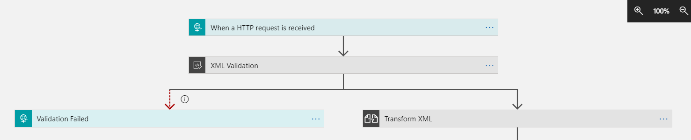

-   Following Transform Xml action, we want to track orders coming from Contoso.
    We add a “Compose” action and specify items we want to track in this action

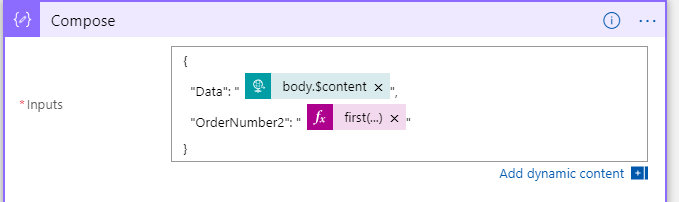

-   Next we want to send transformed order to the service bus queue we created.

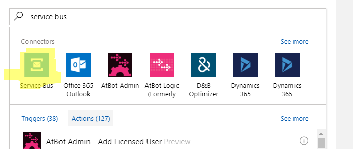

-   Choose Send Message

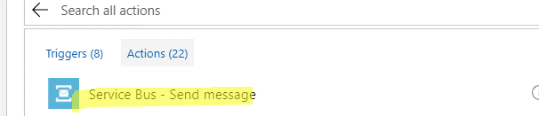

-   Configure action as below.

    -   The Xml content is set to Transformed Xml so that transformed SAP
        message will be sent.

    -   The queue name is set to queue-contoso-to-sap so that message will be
        placed in the queue we used to communicate between SAP and our flow
        system.

    -   Content Type is set to application/xml to specify that message is in xml
        format. Details of content types in Logic App are described here:
        <https://docs.microsoft.com/en-us/azure/logic-apps/logic-apps-content-type>

-   This Action should only be triggered when Transform Xml succeed

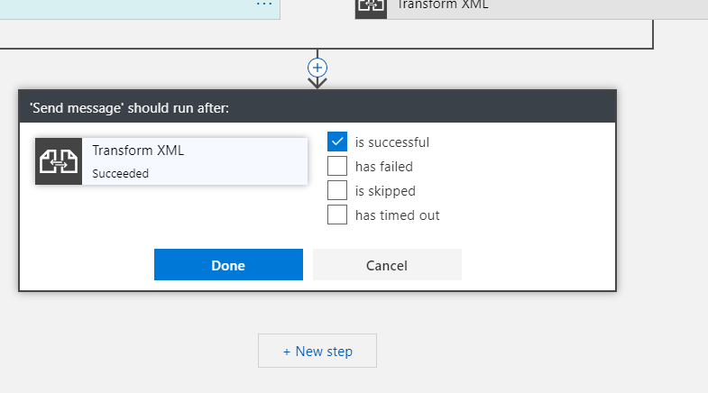

-   Now your Logic App should look like this

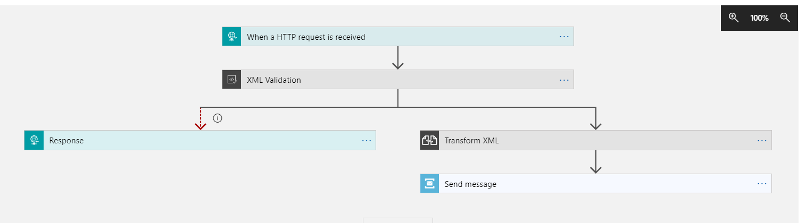

-   Next, we want to send response message to Contoso stating that we have
    successfully received order and successfully validate incoming message.

>   An order can take several days to proceed, so here we are not returning
>   actual order result to our trading partner, but only a notification of
>   acceptance.

-   Add a Response Action

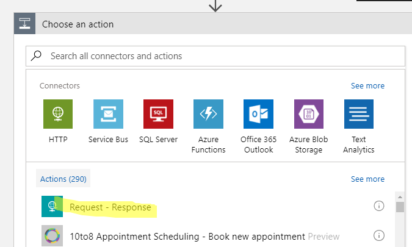

-   Here we just notify Contoso that we have accepted incoming order

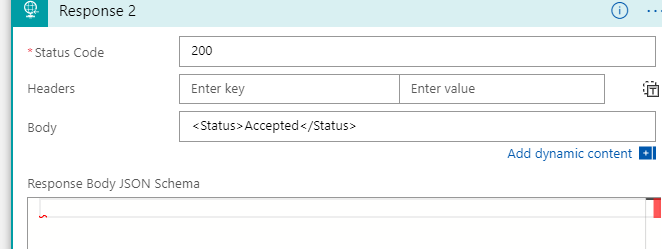

-   Save your Logic App
