Overview
========

In this lab we will be creating an adapter flow that sends messages to trading
partners, in this case, Contoso, via a file stored in Azure Storage Blob. We
will be periodically looking for messages that will be sending to Contoso from
an internal Service Bus Queue and save them to a Storage blob.

Typical scenario can have transform Xml involved as well since we want to
transform internal message format to external message format. But here we assume
message has been transformed to external message format in orchestrator flow.
Here we want to address how to split batch messages into single message and
process them individually.

A high-level architecture illustrated below

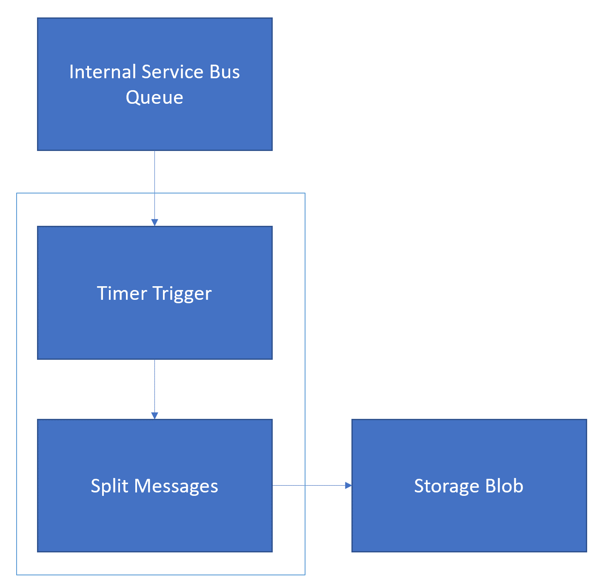

Prerequisites
=============

-   Azure Subscription

-   A Storage Account

Create Receiver Adapter flow
============================

-   Go to Azure Portal, Create a new Logic App

-   Create a Recurrence trigger

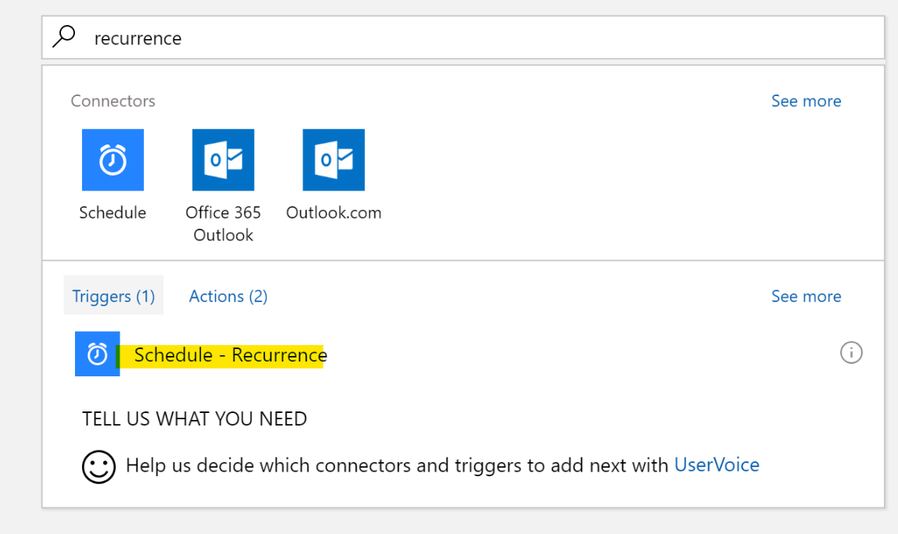

-   Here you specify interval for the Logic App to run. For demo purpose we can
    set to a smaller value. Note that Logic App is charged by transaction,
    smaller check period incurs higher cost.

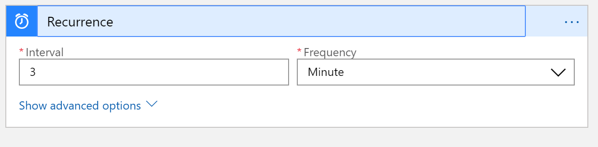

-   Next, we want to read messages from the queue. Peek lock means that we want
    to “peek” the queue to see if there’re any messages coming. If so we lock
    that message so that other application won’t be able to access to it. This
    is to prevent concurrent process.

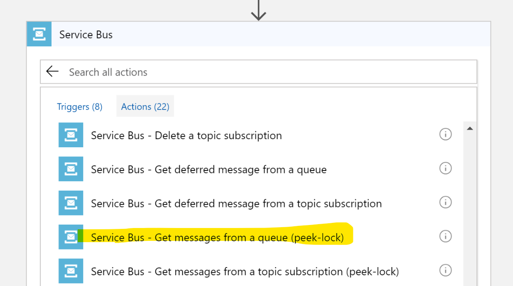

-   We pick the Service Bus Queue we want to peek, and then the batch size

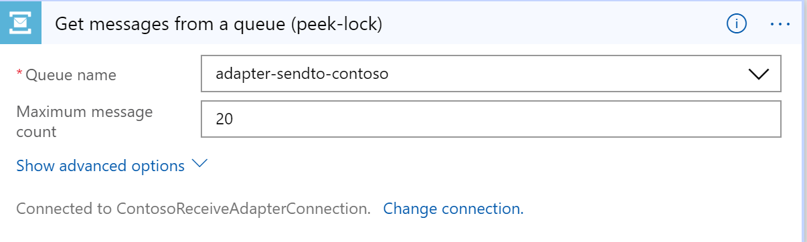

-   Since we are to send message to Contoso here, we use default “main” queue as
    our peek target. In other cases when you want to handle expired undelivered
    messages for error handling, you may want to peek “Deadletter” queue

-   Now we have by default up to 20 messages in a batch, we want to send them
    individually to Contoso, meaning we have to split them into 20 individual
    messages. We do that by adding a For-Each loop here

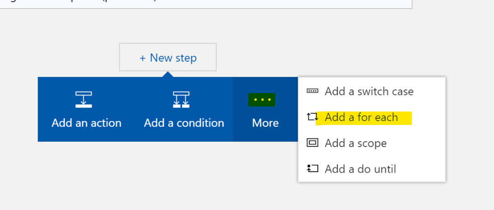

-   The message body is the body of our Service Bus Queue action, each
    represents one single message

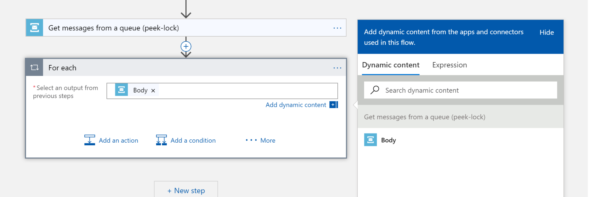

-   Add an action

-   We want to store each file in a storage blob

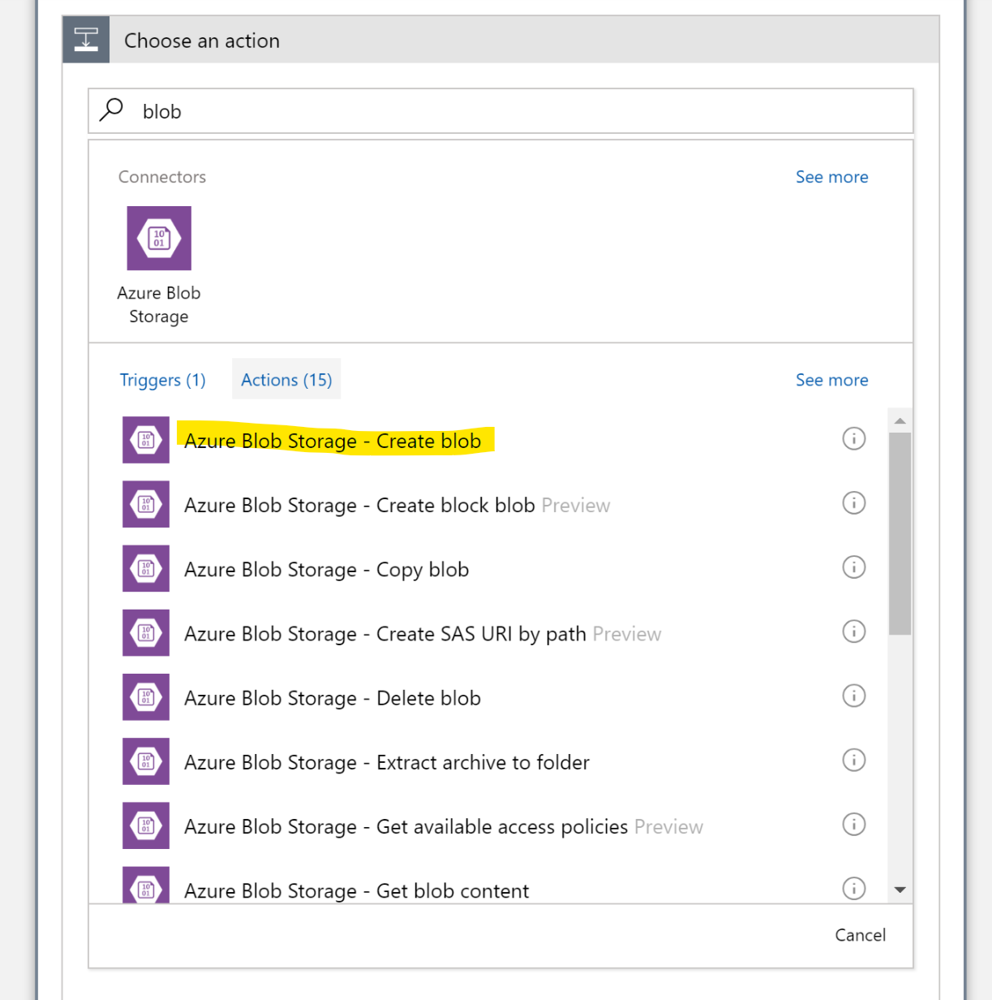

-   Specify message information

    -   Blob name should be unique, here we use the OrderID-LockToken.txt as our
        blob file name

    -   Blob content is the message content to be sent, here it is the Content
        of Service Bus queue action

    -   Folder path is where the file should be stored in that particular
        Storage account

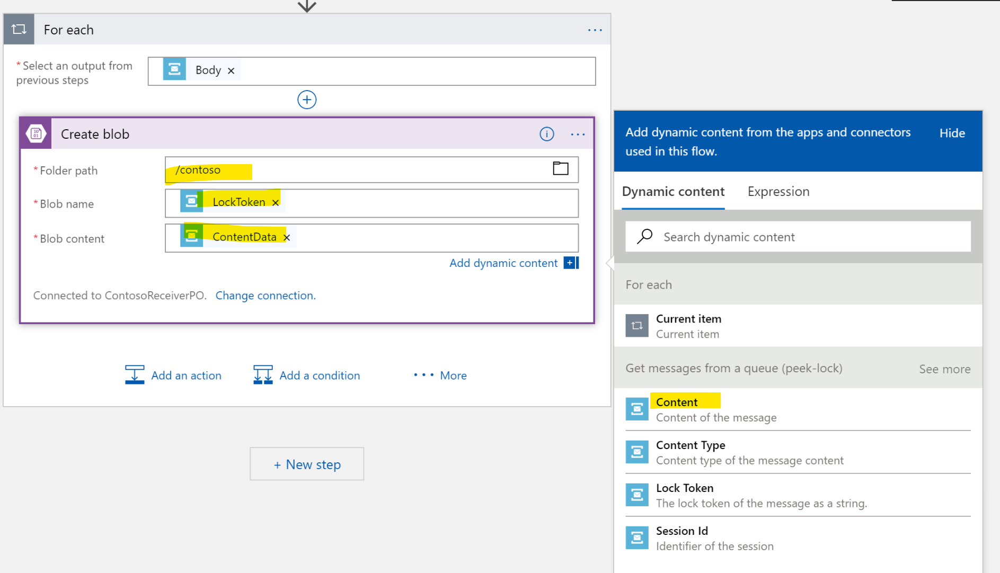

-   Move your cursor to Blob name filed, we now want to create naming template
    for all messages.

>   Note that messages coming from Service Bus is in byte array format, and is
>   converted to Base64 string, hence here we need to first decode base 64
>   string, and then use XQuery to get OrderID from the xml document. We do this
>   by using “Expression”

-   **decodeBase64(item**s**(**'For_each'**)**['ContentData']**)** gives you the
    base 64 decoded string from current item.

-   **xml(decodeBase64(item**s**(**'For_each'**)**['ContentData']**))** convert
    string into a xml object

-   xpath(xml(decodeBase64(items('For_each')['ContentData'])),'//OrderId/text()')[0]
    gives you first OrderID node’s inner text which is the Order Id

>   Fill in below code to right Expression panel then click OK or Update

>   xpath(XML(decodeBase64(items('For_each')?['ContentData'])),'//OrderNumber/text()')[0]

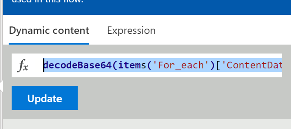

-   You Action should looks like this

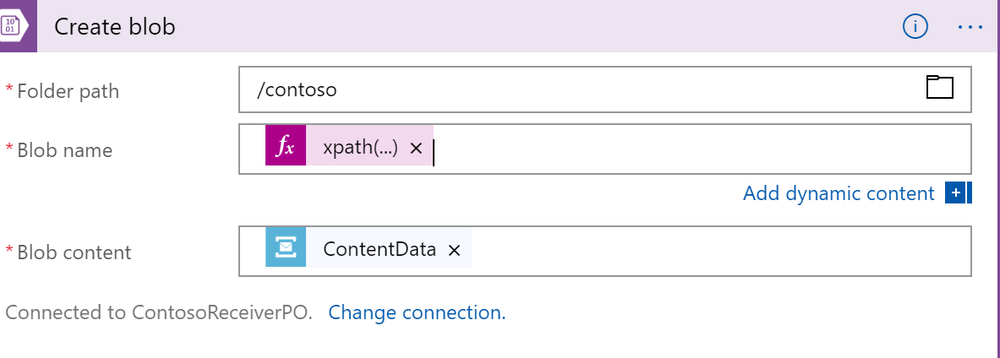

-   Complete the Blob name as below

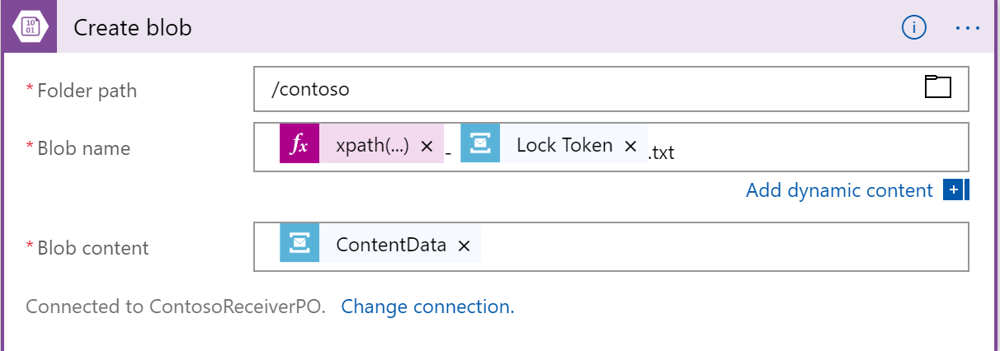

-   Now we are to specify the storage account we want to use. You have to create
    one in advance

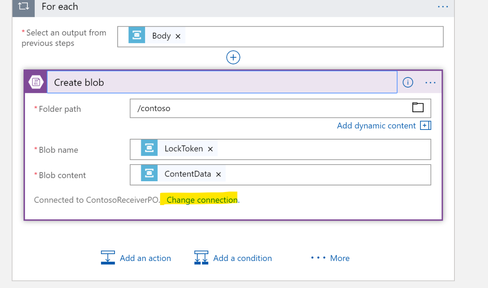

-   Add a new connection

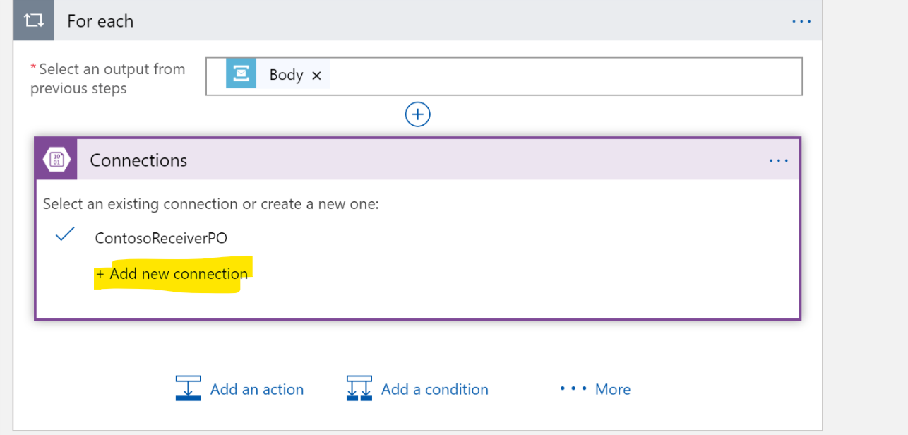

-   You can choose one Storage account from you subscription, or manually input
    connection information.

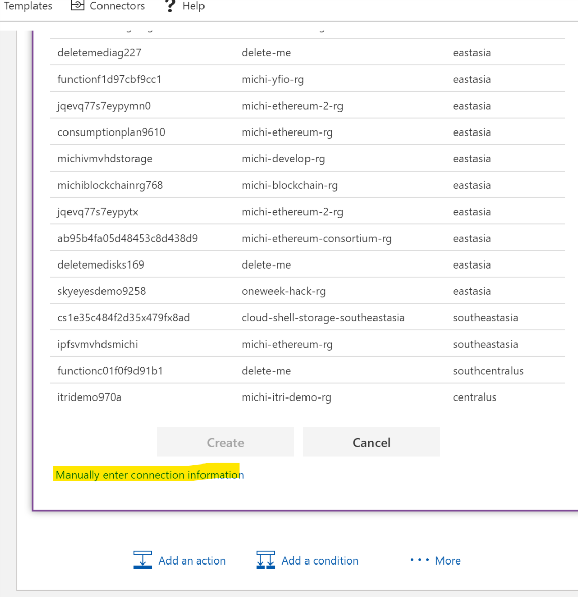

-   Now that message is stored to Contoso specified Storage, we then need to
    “complete” this message from Service Bus queue so that it is removed from
    the queue and no other application will be receiving it again.

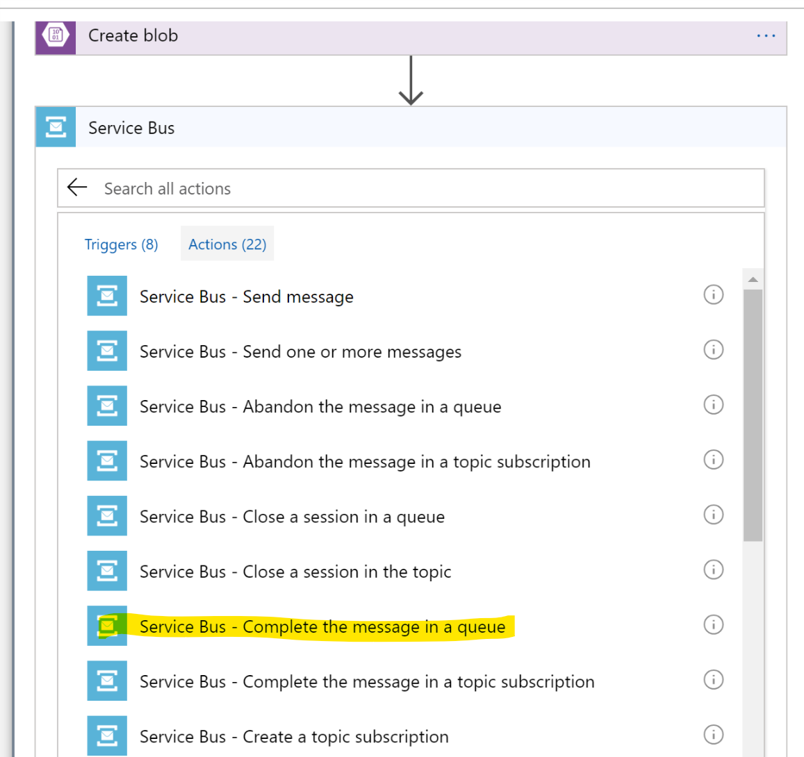

-   Specify the queue and token of that message we are to complete.

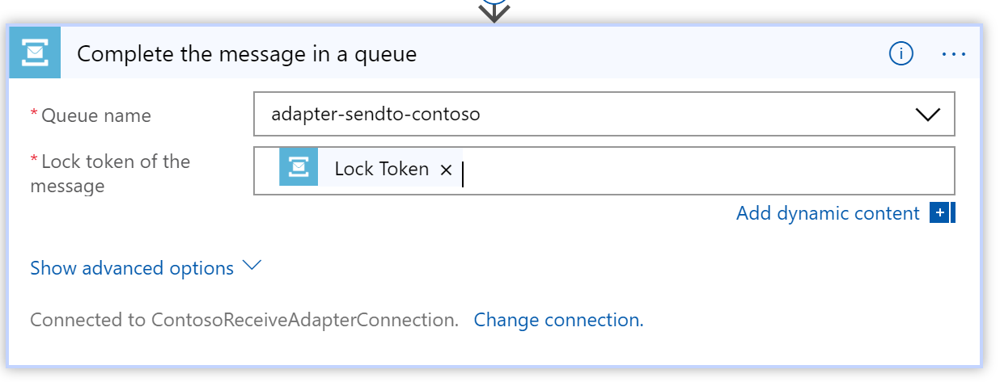

-   Your logic app should looks similar like this

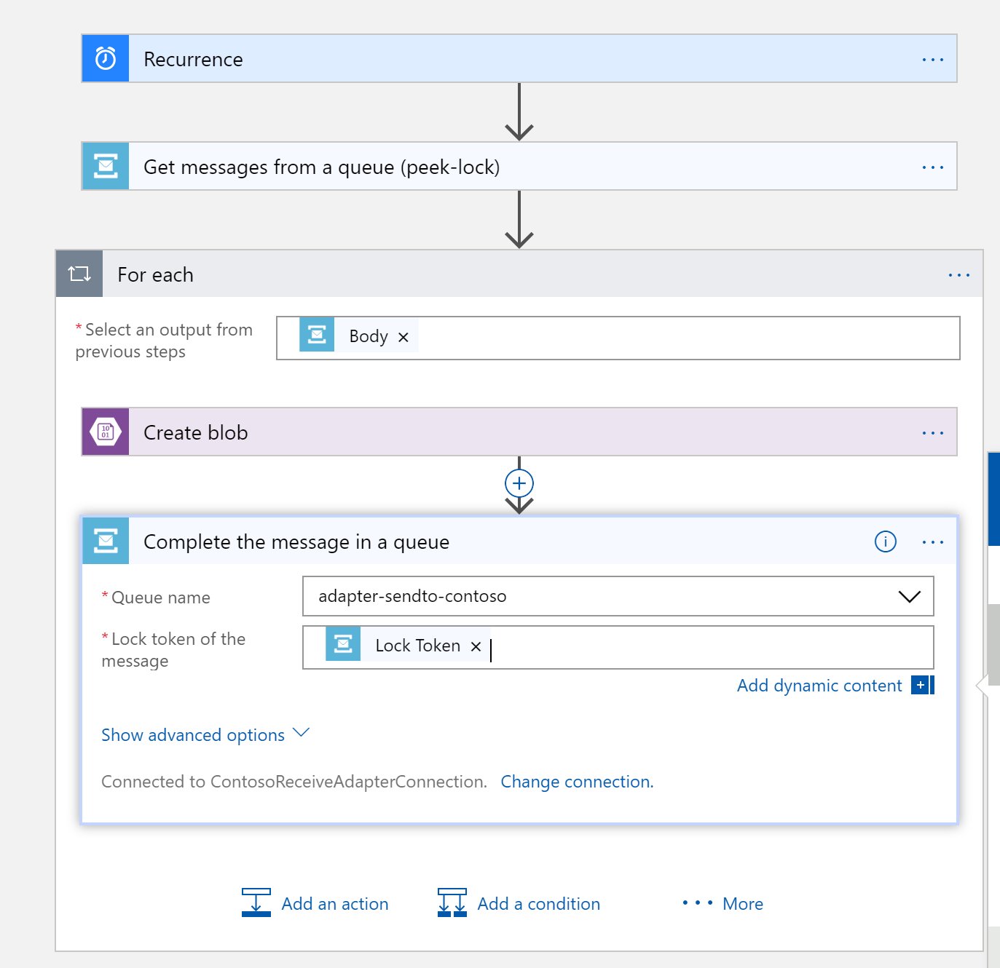

-   Save the Logic App
