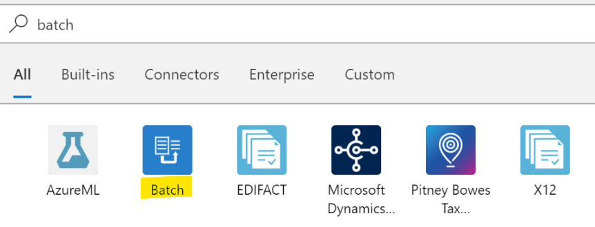
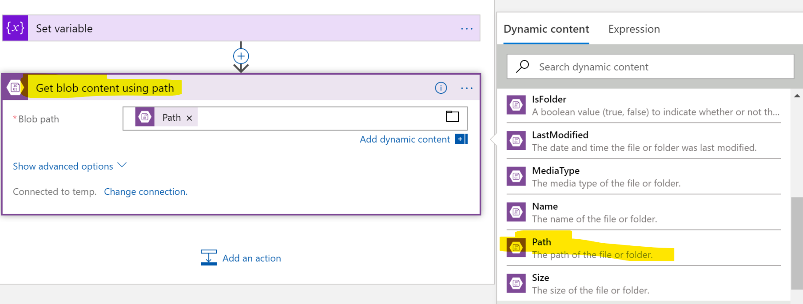

Overview
========

Batch Processing is a common scenario while doing EAI solution, batch processing usually involves system integration. System A sending batch messages to our EAI solution, our EAI solution may need to correlate all these messages into one bigger message for further processing.
In this document, I will be demonstrating how to leverage Logic App's batch feature to help you collect messages and process them as a batch.

High level architecture
=======================
A high level architecture would be like below.
External system send files to pre-configured storage account, each file names start with a batch Id, in this case, 001, 002...etc. Our batch sender process with correlate all 3 files with same batch Id into one big message and send to batch receiver process.


Design Batch Receiver flow
==================================

This flow receives batch messages from Batch Sender flow. It waits until all three files were recevied before it process further. As a demo I will not implemenet actual process here but will simply print out message detail in the flow. In real case you may need to iterate all three files, retrieve their content and aggregate and process them.

You may also want to delete or move received files to another location in order to prevent duplicate processing, this is also NOT convered in this document.

-   Batch Receiver flow will stay idle until all three files are received. We use a Batch trigger to wait files sent by Batch Sender flow.



-   Specify required information
    -   Batch Name is the unique identifier of this batch flow, batch sender sends different batches from different systems to different flow by this name.
    -   Release Criteria is how Batch release batch messages for furture processing, in this case, Batch are released only when we have three files.


-   Add a Compose action, specify "Message Content" in "Input" field. Logic App Desinger automatically wrap Componse action with a "For Each" loop as Batch Trigger return an array.


-   Your flow shoud look like this


Design Batch Sender flow
==================================

In this demo, batch files are named with below pattern.
```
{BATCH-ID}-{FILE-Type}.txt
```
    For example, 001-OrderDetail.txt

-   We need a workflow to check the storage account periodically for incoming files. Once we have new files, the process will then extract file name and file content. In order to check storage account, first we want to create a Storage trigger.


-   Specify Storage account and container name where files are sent to and save configuration.


-   Add a new List Blob action (under Storage Blob catalog), specify the Storage and container where files are sent.


-   Add a "Initialize Variable" action and create a String variable called "sessionId". This is the session Id Logic App used to identify different batches. In our case, this is the first part of batch files.


-   Add a For Each loop


-   We will iterate each item returned from "List Blobs" action


-   Add a Set Variable action to change SessionID variable we created above


-   Specify "Current Item" to Value field


-   Switch to "Code View", modify action script as below


-   Add "Get Blob Content using Path" action, specify "Path" as its path



-   Add a "Batch" action, select "Batch Receiver" flow we created above


-   Batch Name set to "demo" which is exact same with the batch name we specify in "Batch Receiver" flow


-   Contruct you own message in "Message Content" field, in this case I am creating a Json object contains all information and file content. Also set "Partition Name"to the SessionID variable we assigned above.


-   Save

-   To verify result, upload 3 files with names start with 001 (ex, 001-A.txt, 002-B.txt, 003-C.txt), you will see you Batch Sender flow receives 3 files and send information to Batch Receiver.

