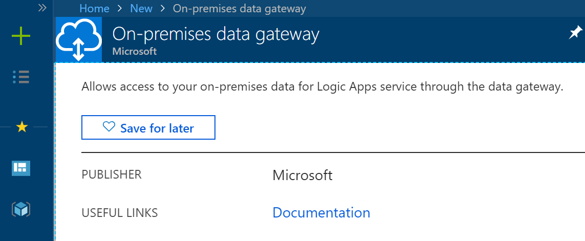

Overview
========

In this lab we will be creating a Logic App that connect to an on-prem Web
Service via an on-prem data gateway.

Install on-prem data gateway on local computer
==============================================

-   Download and install data gateway on a local computer that is not the Domain
    Controller and has access to the on-prem resource, in this case, a web
    service.

-   Download and Install Data gateway in a computer that has access to the
    resources we want to access from Azure.

-   Provide a work or school email, this email has to be managed by Azure AD and
    has to be the same one you use to login Azure Portal

-   Provide required information, since this is our first time creating a Data
    gateway, we are not joining existing cluster.

    To change region of this gateway, click “Change Region”, default region is
    West Central US.

-   Once configured completed you will be prompt a summary

Register data gateway in the Cloud
==================================

-   Now we are to associate our cloud infrastructure with installed on-prem data
    gateway. To do this, create a new on-prem data gateway in Azure Portal.

-   Fill in required information. Note that you need to select a region that
    matches the region your date gateway was installed

-   Once created, create a new Custom Connector

-   We want to create a WSDL wrapper hence here we upload WSDL we retrieved from
    Web Service

-   Once successfully loaded WSDL, information should be automatically
    populated. Verify if the hostname is valid and Check the “Connect via
    on-prem data gateway” checkbox

-   Proceed to update connector

Invoking on-prem web service in Logic App
=========================================

-   Now that we have successfully created a on-prem Gateway connection. We are
    good to use it in Logic App.

    To do this, create a new Logic App, add an Action with customer connector
    type

-   Choose the Web Method we want to invoke

-   Choose Gateway from the dropdown list

-   Fill in parameters

-   Save and run and you should see the result of on-prem web service

