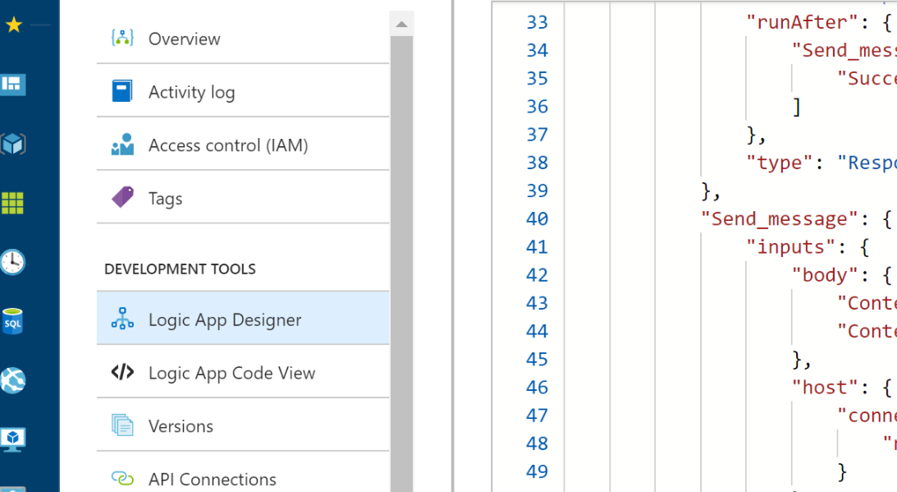
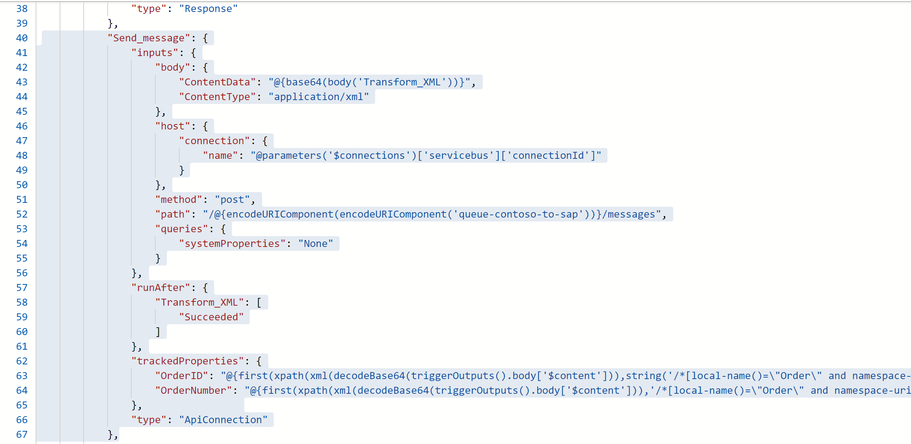
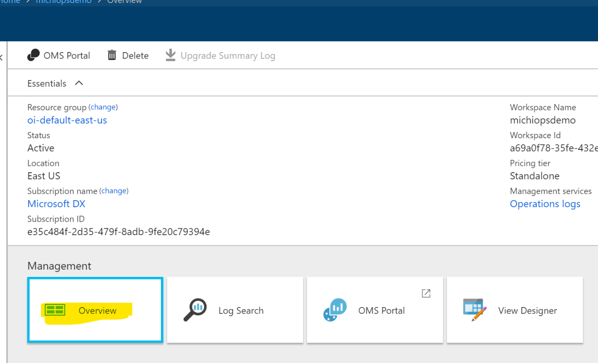
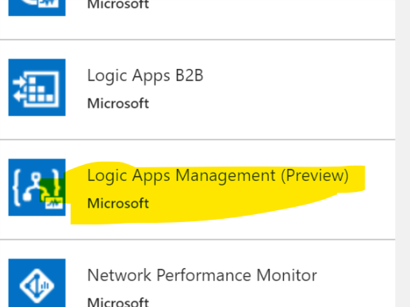
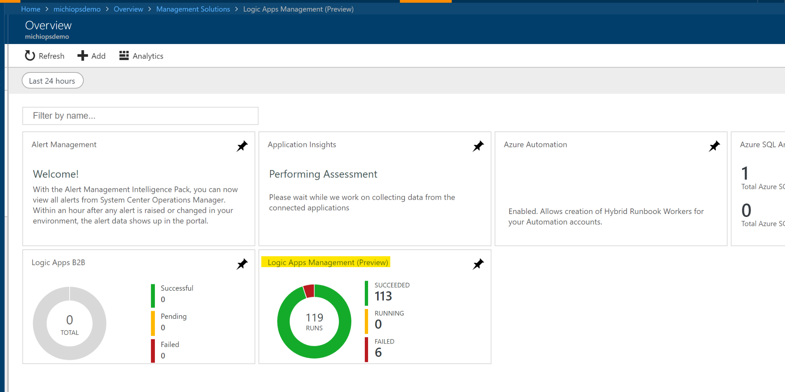
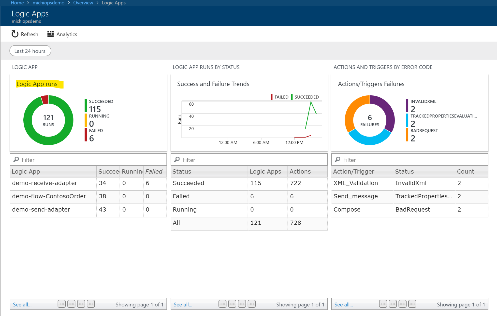
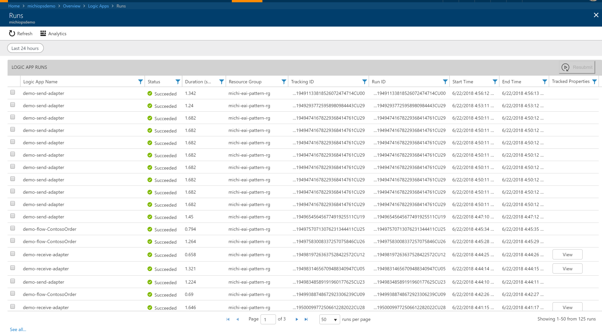
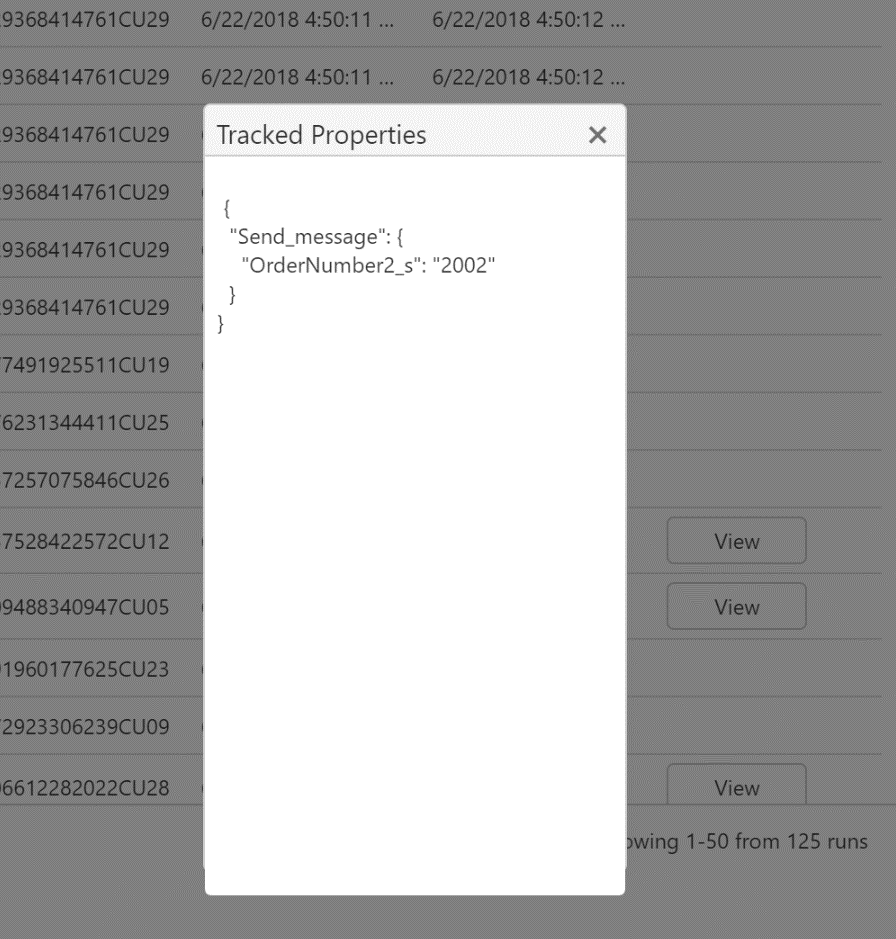
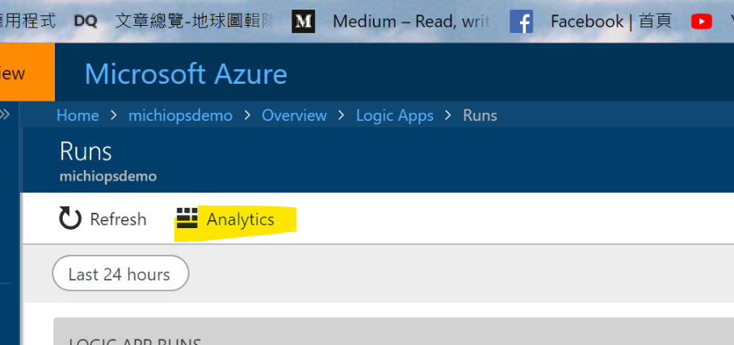

Overview
========

In this lab we will add monitoring mechanism to our Logic App so that we can
track Logic App run status in Log Analysis service.

Add Tracked Properties
======================

In each Logic Action, you can add “Tracked Properties” to it. A tracked property
is a property that holds important information of incoming or outgoing message
such as Order Number or Customer ID…etc. Tracked Properties will be send to
specified diagnostic log storage for future processing and tracking.

-   To add a tracked property, open Logic App Code View of your receiver adapter
    flow

-   Add below code to your Send_Message action

"trackedProperties": {

"OrderNumber2":
"\@{first(xpath(xml(decodeBase64(triggerOutputs().body['\$content'])),'//OrderNumber/text()'))}"

},

-   Your Send_Message should look similar below

-   Save it and the Post a new message to APIM endpoint

Monitor Message and Logic App Runs
==================================

-   Go back to Azure Portal, Open the Log Analysis instance you configured Logic
    App to send diagnostic logs to and click Overview

-   You should see a default dashboard. Now we want to add Logic App solution
    into our dashboard, Click “Add” to add a new solution

-   Add Logic Apps Management (Preview)

-   Once added, wait few minutes for data to populate, you should see some data
    shown in the dashboard.

-   Click on Logic Apps Management (Preview) tile will bring up a detail
    dashboard

-   Click “Logic App Runs” will show you detail information of each run

-   Tracked Properties we added in previous step has been added to the view as
    well.

-   Click Analytics

-   Start a new Tab and input below query to query window, this will search for
    “demo-receive-adapter” Logic App runs has Tracked Properties OrderNumbers2
    with value equals “2001”

>   AzureDiagnostics

>   \| where Category == "WorkflowRuntime"

>   \| where resource_workflowName_s == "demo-receive-adapter"

>   \| where (trackedProperties_OrderNumber2_s) == "2001"
